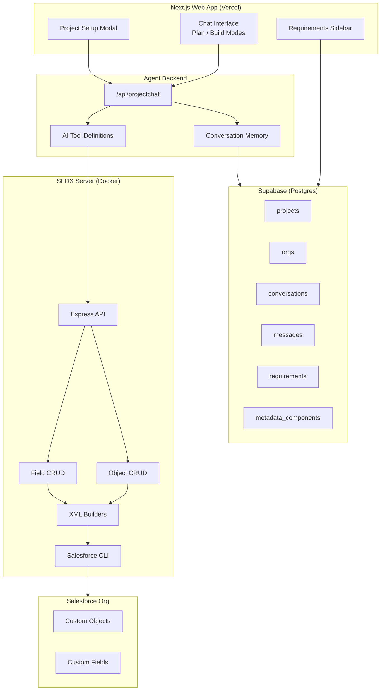
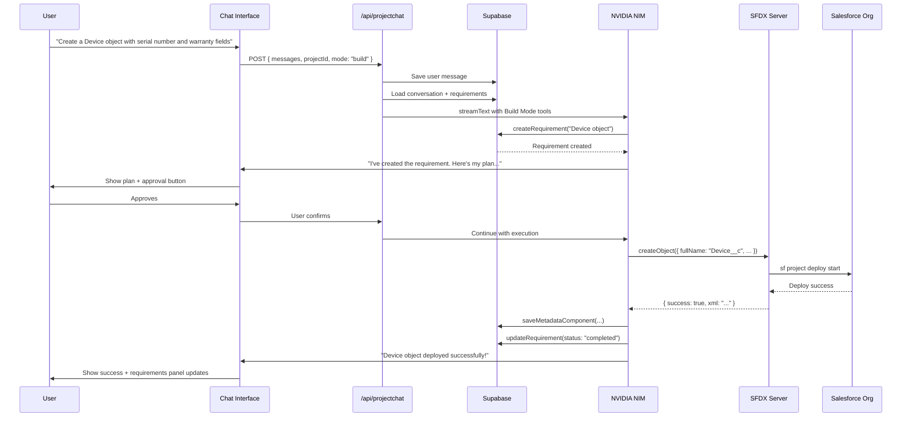
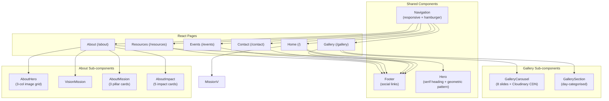
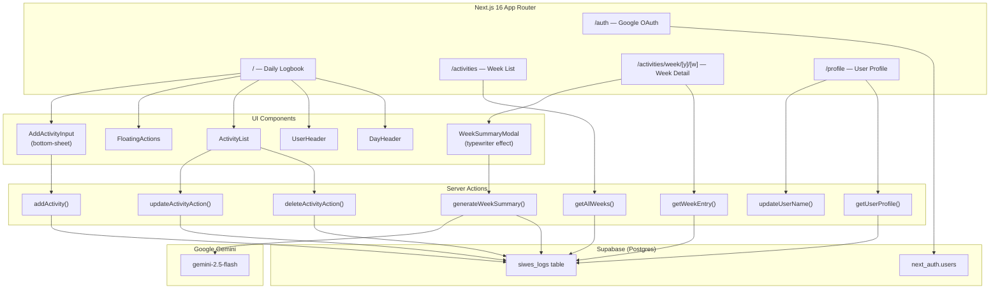

# **A TECHNICAL REPORT ON THE STUDENT INDUSTRIAL WORK EXPERIENCE SCHEME (S.I.W.E.S) UNDERTAKEN AT**

# **DKLOUD CONSULTING**

**PRESENTED TO**

**THE DEPARTMENT OF COMPUTER SCIENCE BABCOCK UNIVERSITY**

**BY**

**DAAP, MISHAEL VICTOR**

# **23/1127**

# **COMPUTER SCIENCE JULY 2026**

---

# **CERTIFICATION** {#certification}

This is to certify that I, **DAAP MISHAEL VICTOR** hereby declare that the information in this report was written by me. It is true that I did the Student Industrial Work Experience Scheme (SIWES) otherwise known as Industrial Training (IT), between **January 5th, 2026** and **July 9th, 2026**.

Student's name: Daap Mishael Victor

Student's matric no: 23/1127

Student's signature: _________________________

SIWES Coordinator/Supervisor: _________________________

Oral IT-Defense Coordinator: _________________________

---

# **IDENTIFICATIONS** {#identifications}

**STUDENT IDENTIFICATION:**

**Student name:** Daap Mishael Victor

**Matric No.:** 23/1127

**Email:** themishaeldaap@gmail.com

**Level:** 300

**Course of study:** Computer Science

**Mobile number:** 09160567358

---

**COMPANY IDENTIFICATION:**

**Company name:** Dkloud Consulting

**Postal Address & traceable location of company:** Opposite Civil Defense Headquarters Abattoir Road Jos Plateau State

**Geographical state:** Jos, Plateau State

**Company Email:** info@dkloudconsulting.com

**Company Website:** https://dkloudconsulting.com

**Staff strength (Number of staff):** 1 - 10

**Name of Industry-Based Unit Head (immediate supervisor):** Jatau Shedrack Sati

---

# **ACKNOWLEDGEMENT** {#acknowledgement}

I want to express my sincere gratitude to the following individuals and organizations for their support during my SIWES internship:

* The **SIWES organization** and the Computer Science Department of **Babcock University**, for providing the opportunity to participate in the SIWES program.
* My **supervisor at Dkloud Consulting**, Mr. Jatau Shedrack Sati, for his guidance, mentorship, and willingness to share knowledge and expertise throughout my internship.
* The entire **Engineering team at Dkloud Consulting**, for creating a welcoming and supportive work environment where I could learn and grow.
* The **SIWES coordinators** at Babcock University, for always being available to answer questions and offer guidance throughout my internship.
* My **SIWES inspector** for providing valuable feedback, which helped improve my performance.
* My family and friends, for their encouragement and understanding during this time.

This SIWES internship has been an enriching experience that has equipped me with skills and knowledge that will benefit my future career. I am incredibly grateful for the support and guidance I received from everyone mentioned above.

---

# **TABLE OF CONTENTS** {#table-of-contents}

[CERTIFICATION I](#certification)

[IDENTIFICATIONS II](#identifications)

[ACKNOWLEDGEMENT III](#acknowledgement)

[TABLE OF CONTENTS IV](#table-of-contents)

[CHAPTER ONE: INTRODUCTION TO SIWES 1](#chapter-one-introduction-to-siwes)

1. [INTRODUCTION TO SIWES 1](#introduction-to-siwes)
2. [VISION STATEMENT OF SIWES 1](#vision-statement-of-siwes)
3. [MISSION STATEMENT OF SIWES 1](#mission-statement-of-siwes)
4. [CORE VALUES OF SIWES 1](#core-values-of-siwes)
5. [OBJECTIVES AND IMPORTANCE OF SIWES 2](#objectives-and-importance-of-siwes)

[CHAPTER TWO: COMPANY PROFILE 3](#chapter-two-company-profile)

1. [ABOUT DKLOUD CONSULTING 3](#about-dkloud-consulting)
2. [DKLOUD CONSULTING'S VISION AND MISSION STATEMENT 3](#dkloud-consultings-vision-and-mission-statement)
3. [CORE VALUES 4](#core-values)
4. [SERVICES RENDERED AND CLIENTS 4](#services-rendered-and-clients)
5. [ORGANIZATIONAL STRUCTURE 5](#organizational-structure)

[CHAPTER THREE: RESPONSIBILITIES AND PARTICIPATION 6](#chapter-three-responsibilities-and-participation)

1. [RESPONSIBILITIES 6](#responsibilities)
2. [PARTICIPATION 7](#participation)

[CHAPTER FOUR: WORK EXPERIENCE AND KNOWLEDGE GAINED 8](#chapter-four-work-experience-and-knowledge-gained)

1. [SALESFORCE METADATA DEVELOPMENT 9](#salesforce-development-and-salesforce-metadata-tools)
2. [AI AGENT DEVELOPMENT ON SALESFORCE — METAFORCE PLATFORM 11](#ai-agent-development-on-salesforce)
3. [NONPROFIT WEBSITE DEVELOPMENT — TECH TRAILBLAZERS FOUNDATION 13](#nonprofit-website-development)
4. [SIWES LOGBOOK APPLICATION — PERSONAL ACTIVITY TRACKER 15](#siwes-logbook-application)
5. [CLIENT ENGAGEMENT AND AI RESEARCH 17](#client-engagement-and-ai-research)

[CHAPTER FIVE: SUMMARY AND CONCLUSION 19](#chapter-five-summary-and-conclusion)

1. [SUMMARY 19](#summary)
2. [FACTORS AFFECTING PERFORMANCE 20](#factors-affecting-performance)
3. [RECOMMENDATIONS 21](#recommendations)
4. [CONCLUSION 22](#conclusion)

---

# **CHAPTER ONE: INTRODUCTION TO SIWES** {#chapter-one-introduction-to-siwes}

## **1.1 INTRODUCTION TO SIWES AND ITF** {#introduction-to-siwes}

The Students Industrial Work Experience Scheme (SIWES) was established in 1973 by the Industrial Training Fund (ITF). Its purpose is to provide students in tertiary institutions with practical experience to complement theoretical learning, helping to prepare them for the workplace. Prior to SIWES, many graduates were seen to lack hands-on skills, especially in using machinery or equipment not available in academic institutions.

SIWES exists to bridge the gap between theory and practice. It aims to expose students to real-life work settings, work methods, and hands-on experience with tools and equipment that may not be available in their institutions. By doing so, it equips students with the practical competence required by employers and ensures a smoother transition from academic life to the world of work.

The Industrial Training Fund Act (ITFA), enacted on 8 October 1971, gave legal force to the ITF. The ITF was created to promote and facilitate the acquisition of industrial and commercial skills among Nigerians so as to build a competent indigenous workforce capable of meeting national economic demands. The Fund works cooperatively with industries and commercial enterprises to enable students carry out industrial attachments relevant to their area of study.

The ITF is organized with a Governing Council, multiple administrative Departments and Units, Area Offices, Training Centres, and a specialized Centre for Industrial Training Excellence.

*[SOURCE: [https://www.siwes.itf.gov.ng/Identity/LandingPage/About](https://www.siwes.itf.gov.ng/Identity/LandingPage/About)]*

---

## **1.2 VISION STATEMENT OF SIWES** {#vision-statement-of-siwes}

* To be the leading Skills Training Organisation in Nigeria and one of the best in the world.
* To be the leading Human Capital Development Organisation in Nigeria and one of the best in the world.

---

## **1.3 MISSION STATEMENT OF SIWES** {#mission-statement-of-siwes}

To set, regulate training standards and provide need-based human capital development interventions using a corps of highly competent professionals in line with global best practices.

---

## **1.4 CORE VALUES OF SIWES** {#core-values-of-siwes}

* **Commitment** — dedication to delivering quality training and development.
* **Loyalty** — unwavering allegiance to the goals of the scheme and its stakeholders.
* **Integrity** — upholding honesty and ethical standards in all operations.
* **Professionalism & Creativity** — delivering services with competence and innovative thinking.
* **Efficiency & Effectiveness** — achieving results with optimal use of resources.
* **Teamwork** — collaborative effort towards shared objectives.

---

## **1.5 OBJECTIVES AND IMPORTANCE OF SIWES** {#objectives-and-importance-of-siwes}

The Student Industrial Work Experience Scheme is designed to accomplish several objectives that contribute to both the students' growth and national development. Its objectives include:

1. To provide a means for students to acquire industrial skills and experiences relevant to their fields of study.
2. To expose students to work methods, equipment, and techniques often unavailable in their academic institutions.
3. To prepare students for the industrial work situations they are likely to face after graduation.
4. To enhance the transition from school to the workplace, improving employability and fostering contacts for future job placements.
5. To enable students to apply theoretical knowledge in real work settings, thereby bridging the gap between academics and practice.
6. To assist students in assessing their interest in and suitability for their chosen profession.
7. To satisfy accreditation requirements set by educational regulatory bodies.
8. To engage employers and industries actively in the educational process, ensuring that training remains relevant to real industrial needs.

*[SOURCE: [https://www.siwes.itf.gov.ng/Identity/LandingPage/About](https://www.siwes.itf.gov.ng/Identity/LandingPage/About)]*

---

# **CHAPTER TWO: COMPANY PROFILE** {#chapter-two-company-profile}

## **2.1 ABOUT DKLOUD CONSULTING** {#about-dkloud-consulting}

Dkloud Consulting is a technology consulting firm specializing in Salesforce implementation and AI-powered application development. Operating as an **AI & App Building Studio**, the company helps organizations leverage the Salesforce platform to streamline business processes, automate workflows, and deliver intelligent digital solutions.

Based in **Jos, Plateau State**, Dkloud Consulting serves clients across Nigeria, providing end-to-end services from Salesforce architecture and configuration to AI agent development and deployment. The company positions itself as a trusted partner for organizations seeking to adopt or optimize Salesforce as their central customer relationship management (CRM) and business operations platform.

Dkloud Consulting combines deep Salesforce expertise with emerging AI capabilities — including agentic AI, Natural Language Processing (NLP), and prompt engineering — to deliver solutions that are both technically robust and strategically aligned with client business goals.

*[SOURCE: [https://www.dkloudconsulting.com](https://www.dkloudconsulting.com)]*

---

## **2.2 DKLOUD CONSULTING'S VISION AND MISSION STATEMENT** {#dkloud-consultings-vision-and-mission-statement}

**Vision Statement**

To be the go-to Salesforce and AI consulting partner for organisations that need intelligent cloud solutions shipped fast — transforming complex business challenges into real outcomes across Nigeria and Africa.

**Mission Statement**

To deliver high-quality Salesforce implementations and AI-powered solutions in weeks, not quarters. Dkloud Consulting combines strategy, design, and delivery into one team so clients get clean rollouts, scalable applications, and measurable business impact without the usual consulting overhead.

---

## **2.3 CORE VALUES** {#core-values}

The culture at Dkloud Consulting is shaped by a commitment to quality, speed, and genuine partnership:

* **Delivery-First Mindset** — focusing on real outcomes delivered rapidly, prioritising working solutions over lengthy documentation cycles.
* **Expert-Led Execution** — maintaining deep technical depth across Salesforce and AI so clients receive solutions crafted by practitioners, not project managers alone.
* **End-to-End Ownership** — staying engaged from strategy and design through implementation and support, ensuring accountability across the full project lifecycle.
* **Collaborative Problem-Solving** — working closely with clients as partners, not vendors, to understand business context and co-create solutions that teams actually adopt.
* **Continuous Innovation** — actively exploring emerging technologies — Agentforce, AI agents, geospatial platforms, and automation — to keep clients ahead of the curve.
* **Small Team, Big Impact** — operating lean and agile, with every team member contributing meaningfully to client outcomes.

---

## **2.4 SERVICES RENDERED AND CLIENTS** {#services-rendered-and-clients}

Dkloud Consulting is a full-stack Salesforce and AI consulting practice operating across Nigeria and beyond. The company delivers strategy, design, and implementation under one team, with a focus on shipping impactful solutions in weeks rather than quarters.

**Service Areas**

* **AI Agents & Automation** — building intelligent AI agents and assistants that automate workflows, connect securely to CRM and business systems, and triage requests from trusted data.
* **Full-Stack Software Development** — designing, developing, and maintaining scalable web, mobile, and enterprise applications using modern frameworks such as React, Node.js, and AI SDKs including Nvidia NIM, Vercel AI SDK, LangChain, and LangGraph.
* **Geospatial & Field Operations** — building map-based platforms for managing field teams and distributed assets, with GPS capture, offline-capable mobile apps, and secure synchronisation.
* **Salesforce Implementation & Integration** — implementing and integrating the full Salesforce stack, including Sales Cloud, Service Cloud, Revenue Cloud, CPQ, and Agentforce, with clean rollouts that stakeholders actually adopt.
* **Data Platforms & Digital Workflows** — designing secure digital platforms for data collection, operational decision-making, and automated approval reporting workflows.
* **Revenue Cloud & CPQ** — streamlining quoting, pricing, and billing processes to turn multi-day turnarounds into same-day quotes with live approval tracking and audit trails.
* **Skills Development & Training** — Salesforce Trailhead-based upskilling and AI education for teams transitioning to agentic workflows.

**Notable Clients and Case Studies**

| Client | Industry | Solution Delivered |
|--------|----------|-------------------|
| **Purple WIFI** (Guest Wi-Fi & Analytics) | Technology / Guest Wi-Fi | Salesforce CPQ roll-out across regions, multi-year ongoing partnership providing scalable product catalog management and ongoing CPQ expansion. |
| **Telserve** (Telecommunications) | Telecommunications | Full Salesforce Sales Cloud and CPQ implementation, unifying sales and marketing on a single platform, delivering faster quote-to-cash cycle and full sales team enablement. |
| **Turtle Enviro** (Environmental Services) | Environmental Services | Salesforce Revenue Cloud roll-out, modernising a manual quoting process — delivering same-day quote turnaround, a single source of truth for pricing, and live approval tracking. |
| **Skydive** (Adventure & Experiences) | Adventure & Experiences | Custom Salesforce-powered voucher management system enabling new experiences to launch in days instead of months, with self-serve voucher redemption for customers. |
| **Family Support by SCTSP** (Non-Profit) | Non-Profit | Full Salesforce design, implementation, and ongoing support to navigate digital transformation in an unfamiliar operational area. |

*[SOURCE: [https://www.dkloudconsulting.com](https://www.dkloudconsulting.com)]*

---

## **2.5 ORGANIZATIONAL STRUCTURE** {#organizational-structure}

Dkloud Consulting operates as a small, tightly-knit team. The organization structure centers around:

* **Industry-Based Unit Head / Supervisor:** Jatau Shedrack Sati — provides direct supervision, technical guidance, and project oversight for the engineering team.
* **Engineering Team:** A compact team focused on Salesforce development, AI agent building, and client solution delivery. Daily stand-up meetings are held at 9:30 AM via Google Meet, with occasional in-office days on Fridays.
* **Interns:** Apprentices who join the engineering team for structured SIWES programs, contributing to live client and internal projects under close mentorship.

The team operates as a lean, close-knit group. With a staff strength of 1–10 people, every member contributes across multiple domains, from Salesforce architecture to AI development and client delivery. The supervisor, Mr. Jatau Shedrack Sati, provides direct technical guidance and project oversight, while interns join the engineering team for structured programs like SIWES, contributing to live client and internal projects under close mentorship.

---

# **CHAPTER THREE: RESPONSIBILITIES AND PARTICIPATION** {#chapter-three-responsibilities-and-participation}

## **3.1 RESPONSIBILITIES** {#responsibilities}

During my 26-week internship at Dkloud Consulting, I was entrusted with a range of responsibilities that spanned Salesforce development, AI agent engineering, prompt engineering, client engagement, and nonprofit technology projects.

**Salesforce Development**

* Configured and customized Salesforce objects, fields, and metadata structures to support client business requirements.
* Developed a Salesforce Metadata Transpiler — a tool that converts JSON schemas into deployable Salesforce metadata ZIP packages, streamlining the deployment workflow.
* Reverse-engineered Salesforce field structures by exporting and analyzing metadata components to design and implement validation rules.

**AI Agent Development**

* Designed and documented the system architecture for a Salesforce Development Agent, identifying and resolving major architectural flaws during the documentation phase.
* Built and integrated AI agents on the Salesforce platform, including an Opportunity Summarization Agent for sales teams and a Patient Record Creation Agent that generates patient records and cases from customer service call transcripts using an NLP pipeline.

**AI Strategy and Prompt Engineering**

* Led AI strategy efforts as the **AI Strategist Lead**, guiding the team's approach to integrating AI capabilities into Salesforce solutions.
* Applied prompt engineering techniques learned through Salesforce Trailhead to improve how AI agents interpret user inputs and generate accurate, context-aware responses.

**Client Engagement**

* Attended client meetings with the Dkloud team to discuss Salesforce implementation requirements, gather business requirements, and contribute to solution design discussions.
* Built Salesforce reports and dashboards for clients to provide actionable business insights.

**Nonprofit Foundation Website**

* Led a full web redesign for a nonprofit foundation using **JavaScript and jQuery**, building multiple pages including the gallery, about page, home page, fliers section, and filter page.
* Implemented responsive design and ensured design consistency across all pages.
* Built the donation section and integrated a chatbot (AimaBot) into the website.

**AI Research and Certification**

* Compiled a comprehensive research report on Salesforce's out-of-the-box AI features for strategic positioning with clients.
* Explored prompt engineering, AI agent frameworks, and AI/ML foundations including supervised learning, unsupervised learning, and reinforcement learning.
* Earned the **Salesforce Agentforce Specialist** certification.

---

## **3.2 PARTICIPATION** {#participation}

Beyond formal responsibilities, I actively participated in activities that broadened my professional exposure and contributed to the team's learning culture.

**Daily Routine and Team Collaboration**

* Attended daily 9:30 AM stand-up meetings on Google Meet to align with the team on project priorities and blockers.
* Participated in Friday in-office sessions, providing opportunities for hands-on collaboration and direct mentorship.
* Engaged in one-on-one sessions with my supervisor to clarify role expectations, review deliverables, and receive feedback on ongoing work.

**Learning and Professional Development**

* Completed structured learning on Salesforce's Trailhead platform, including the **Agent Blazer trail**, which covered agent configuration, topic mapping, risk management, and process mapping for AI agents.
* Studied Natural Language Processing (NLP) fundamentals — text tokenization, entity recognition, and intent classification — and applied these concepts to Salesforce AI agent configuration.
* Set up and configured a Salesforce development environment, including SFDX CLI installation, project workspace configuration, and sandbox environment setup.
* Built a personal activity-tracking application to log weekly tasks, learning outcomes, and project milestones throughout the internship.

**Research and Innovation**

* Researched and compiled a comprehensive report on Salesforce's AI capabilities to inform the company's client positioning strategy.
* Explored prompt engineering techniques and AI/ML paradigms to strengthen the team's approach to building intelligent agents.
* Investigated emerging AI tooling including Nvidia NIM, Vercel AI SDK, LangChain, and LangGraph, evaluating their potential for integration with Salesforce workflows.

**Media and Outreach**

* Participated in a podcast session with the company's social media marketing manager, discussing AI, Salesforce, and technology careers.
* Collaborated on sourcing UI themes for nonprofit website projects, contributing to creative and design decisions for client-facing deliverables.

---

# **CHAPTER FOUR: WORK EXPERIENCE AND KNOWLEDGE GAINED** {#chapter-four-work-experience-and-knowledge-gained}

My internship at Dkloud Consulting provided extensive hands-on experience across three primary technical domains: Salesforce metadata engineering, AI agent development on the Salesforce platform, and full-stack web development. Each project contributed to a progressively deeper understanding of how modern CRM platforms, AI systems, and web applications are designed, built, and deployed in real-world consulting environments.

## **4.1 SALESFORCE METADATA DEVELOPMENT** {#salesforce-development-and-salesforce-metadata-tools}

### **4.1.1 Overview**

Salesforce metadata — the XML-based configuration files that define objects, fields, validation rules, and other platform components — forms the backbone of every Salesforce customization. Manually writing and deploying this XML is error-prone, repetitive, and slow, especially for implementations involving dozens of custom objects with hundreds of fields.

At Dkloud Consulting, client projects frequently required rapid creation and deployment of custom objects and fields. To address this bottleneck, I built the **Salesforce Metadata Transpiler** — a TypeScript-based tool that converts JSON schema definitions into deployable Salesforce metadata packages (.zip files). The transpiler validates the input schema, generates deployment-ready XML for each metadata component, organizes them into the correct Salesforce folder structure, and produces a single ZIP package ready for deployment via the Salesforce Metadata API.

The transpiler was published as an npm package (`@Mishael-dev/sf-metadata-transpiler` v1.0.5) and integrated into the team's workflow as both a standalone tool and as a foundation for the larger Metaforce AI platform (covered in section 4.2).

**The transpilation pipeline follows four distinct stages:**


**Stage 1 — Schema Input:** The developer defines Salesforce custom objects and their fields as structured JSON, following a strict specification that maps directly to Salesforce metadata properties.

**Stage 2 — Validation:** A two-layer validation system first checks that the JSON conforms to the expected structure (required fields, correct types), then applies semantic rules to catch cross-field references, formula integrity, and Salesforce-specific constraints.

**Stage 3 — XML Generation:** Each validated metadata item is converted into its Salesforce XML representation using a generator-per-field-type architecture. Specialized generators handle complex types (Lookups, Master-Detail, Roll-Up Summaries, Formulas), while a generic generator handles simple types (Text, Number, Email, Phone, etc.).

**Stage 4 — Package Assembly:** Generated XML files are merged into their parent objects, organized into the standard Salesforce directory structure, wrapped with a `package.xml` manifest, and compressed into a deployable ZIP.

### **4.1.2 Key Learning**

**Schema Design and Reverse-Engineering**

Before building the transpiler, I had to understand exactly how Salesforce represents metadata in XML. I did this by exporting a comprehensive test object from a Salesforce org — a custom object containing every supported field type — and analyzing its XML structure. This reverse-engineering process revealed the precise tag names, attribute ordering, and nested structures that Salesforce's Metadata API expects.

The resulting understanding was codified into the **LLM Guide** (`docs/LLM Guide.md`) — a strict specification document that tells an LLM exactly how to generate valid JSON input for the transpiler. The guide defines every supported field type, required and optional properties, naming conventions (API names must end with `__c`), and logical constraints (e.g., precision must be >= scale, a Master-Detail field requires `ControlledByParent` sharing model).

```json
{
  "type": "CustomObject",
  "fullName": "Device__c",
  "label": "Device",
  "pluralLabel": "Devices",
  "description": "Represents hardware devices assigned to employees or departments.",
  "deploymentStatus": "Deployed",
  "allowInChatterGroups": true,
  "nameField": {
    "label": "Device Name",
    "type": "Text",
    "trackHistory": false
  },
  "enableActivities": true,
  "enableBulkApi": true,
  "enableFeeds": false,
  "enableHistory": true,
  "enableLicensing": false,
  "enableReports": true,
  "enableSearch": true,
  "enableSharing": true,
  "enableStreamingApi": true,
  "visibility": "Public",
  "fields": [
    {
      "type": "AutoNumber",
      "label": "Device Serial Number",
      "fullName": "Device_Serial__c",
      "displayFormat": "DEV-{000000}",
      "description": "System-generated serial number for internal tracking.",
      "startingNumber": 1
    }
  ]
}
```

**Two-Layer Validation Architecture**

The transpiler implements a two-stage validation pipeline. The `StructuralValidator` checks that the JSON conforms to the expected schema shape — correct top-level `type`, required properties on each field, valid field types. The `SemanticValidator` then applies business rules that go beyond structure:

```typescript
// src/validator/2-semanticValidator/customObjectValidator/rules/checkLookupReferences.ts
export function checkLookupReferences(
  data: CustomObject[],
  context: ValidationContext,
): ValidationError[] {
  const errors: ValidationError[] = [];
  for (const item of data) {
    if (item?.type !== "CustomObject") continue;
    if (!item.fields) continue;
    for (const field of item.fields) {
      if (field.type !== "Lookup") continue;
      if (!field.referenceTo) continue;
      const isValid =
        context.customObjects.has(field.referenceTo) ||
        context.standardObjects.has(field.referenceTo);
      if (!isValid) {
        errors.push({
          level: 2,
          message: `Lookup field "${field.fullName}" references "${field.referenceTo}" which does not exist in schema or standard objects`,
          path: [item.fullName, "fields", field.fullName, "referenceTo"],
        });
      }
    }
  }
  return errors;
}
```

This semantic layer also validates Formula field references (ensuring referenced fields exist in the same object), Master-Detail sharing model constraints, Roll-Up Summary target objects, and cross-field integrity. The three additional semantic rules — `checkFormulaFieldReferences`, `checkMasterDetailReferences`, and `checkRollupSummaryReferences` — follow the same pattern, ensuring that complex relationship fields cannot reference non-existent metadata.

**Generator-Per-Field-Type Architecture**

The XML generation system uses a strategy pattern where each field type has its own dedicated generator. The `XmlGenerator` class maintains a registry of generators sorted by priority and uses a recursive descent approach to process both objects and their child fields:

```typescript
// src/xmlGenerator/orchestrator.ts
export class XmlGenerator {
  private generators: AtomicGenerator[] = [];

  registerGenerator(gen: AtomicGenerator) {
    this.generators.push(gen);
    this.generators.sort((a, b) => a.priority - b.priority);
  }

  public generate(input: any): GeneratedXml[] {
    const results: GeneratedXml[] = [];
    this.processRecursive(input, results, {});
    return results;
  }

  private processRecursive(item: any, results: GeneratedXml[], context: GenerationContext) {
    const generator = this.generators.find((g) => g.supports(item));
    if (generator) {
      const generated = generator.generate(item, context);
      results.push(generated);
      if (generator.getChildItems) {
        const children = generator.getChildItems(item);
        children.forEach((child) => {
          this.processRecursive(child, results, { parentFullName: item.fullName });
        });
      }
    }
  }
}
```

Specialized generators handle Lookup fields (generating both the relationship field and the companion `RecordType`), Master-Detail fields (with `ControlledByParent` sharing), Formula fields (with return type and formula expression), and Roll-Up Summary fields (with aggregate type and target field). Simple field types — AutoNumber, Checkbox, Currency, Date, DateTime, Email, Location, Number, Percent, Phone, Picklist, MultiselectPicklist, Text, TextArea, EncryptedText, LongTextArea, Html, Time, and URL — are handled by the `GenericFieldGenerator`, which maps JSON properties to XML tags dynamically:

```typescript
// src/xmlGenerator/generators/customObjects/fields/genericFieldGenerator.ts
export class GenericFieldGenerator extends BaseFieldGenerator implements AtomicGenerator<BaseJsonField> {
  readonly priority = 30;

  supports(data: any): data is BaseJsonField {
    return SIMPLE_FIELD_TYPES.includes(data.type);
  }

  generate(field: BaseJsonField, context: GenerationContext): GeneratedXml {
    const fullName = this.buildFullName(field.fullName, context);
    const tags = [
      ...this.buildSharedTags(field),
      ...this.buildTypeSpecificTags(field),
    ];
    const xml = this.buildXmlFromTags(tags);
    return { metadataType: "CustomField", fullName, parentFullName: context.parentFullName, xml };
  }
}
```

**Package Assembly and Deployment**

The final stage assembles generated XML into a deployable package. The `PackageBuilder` orchestrates four components: the `MetadataMerger` nests CustomField XML into their parent CustomObject files, the `FileOrganizer` maps each artifact to its correct path in the Salesforce directory structure, the `ManifestGenerator` produces the `package.xml` deployment manifest, and the `OutputHandler` writes everything to disk as a ZIP archive:

```typescript
// src/packageBuilder/PackageBuilder.ts
export class PackageBuilder {
  public async build(artifacts: GeneratedXml[]): Promise<BuildResult> {
    const mergedArtifacts = this.merger.mergeFields(artifacts);
    const fileMap = this.organizer.organize(mergedArtifacts);
    const packageXml = this.manifestGen.generate(mergedArtifacts);
    fileMap.set('package.xml', packageXml);
    await this.outputHandler.write(this.options, fileMap);
    return { success: true, outputPath: this.options.outputDirectory, filesWritten: Array.from(fileMap.keys()) };
  }
}
```

**LLM Integration for Metadata Generation**

A key innovation of the transpiler was its companion LLM Guide — a structured prompt document that enables LLMs to generate valid JSON input for the transpiler without hallucinating unsupported field types or violating Salesforce naming conventions. The guide explicitly lists supported and unsupported field types, required properties per type, and logical constraints:

> *"If a field type is not listed below, DO NOT generate it."*
> *"The following field types are NOT currently supported by the transpiler and MUST NOT be generated: Lookup, MasterDetail, Summary (Rollup Summary)."*

This approach turned the transpiler into an AI-assisted development tool — an LLM reads the requirements, generates strictly valid JSON, and the transpiler converts it into a deployable package, reducing the manual metadata development cycle from hours to minutes.

**Client-Facing Salesforce Work**

Beyond tool development, I contributed directly to Dkloud's client implementation projects. In week 3, I attended a client meeting with the Dkloud team to discuss an ongoing Salesforce implementation, gathering requirements and aligning on project milestones. I then collaborated on building Salesforce reports and dashboards for the client, creating data visualizations that provided actionable insights into sales performance and customer engagement metrics. In week 5, I contributed to designing the data model for a client implementation project during a dedicated client meeting, and created three quarterly expenditure reports supporting financial analysis for the engagement. I also supported several Salesforce org administration tasks — exporting all metadata types to support as-built documentation (week 5), cleaning up test records from development environments (week 5), and configuring data models and role-based access for users (week 16).

### **4.1.3 Challenges Faced**

**Schema Bug in the JSON-to-XML Pipeline**

Early in the transpiler's development (week 5), I encountered a critical bug in the schema validation layer. The transpiler was failing to correctly parse certain JSON field definitions, producing malformed XML that would have caused deployment failures in Salesforce. Resolving this required tracing the validation flow through both the structural and semantic layers, identifying where field type mappings diverged from Salesforce's expected format, and implementing corrected transformation rules. The fix involved updating the field mapping logic to ensure every JSON property was correctly translated into its Salesforce XML equivalent, including handling edge cases like formula expressions with special characters and picklist value sets with restricted access patterns.

**Field Type Edge Cases**

Salesforce's metadata API supports numerous field types with subtle differences in their XML representation. For example, Formula fields require a `returnType` attribute and a CDATA-wrapped formula expression, while Roll-Up Summary fields need a `summaryForeignKey` and an `aggregateType` (sum, min, max, count). The initial transpiler version handled only basic field types. Expanding support to the full 20+ field types required careful analysis of each field's XML structure — especially relationship fields like Lookup, Master-Detail, and Roll-Up Summary, which have nested child elements and strict ordering requirements. This was resolved by creating dedicated generator classes for each complex field type, each producing the exact XML structure Salesforce expects.

**Deployment and Environment Configuration**

In week 24, I experienced deployment failures caused by environment mismatches — the transpiler worked correctly in the local development environment but produced errors when deployed to production infrastructure. This taught me the importance of validating deployment artifacts against the target Salesforce org's API version and checking that generated XML conforms to the metadata API's strict validation rules before attempting deployment. The solution involved adding environment-specific validation checks and testing the transpiler against the actual Salesforce org's metadata structure before every deployment attempt.

## **4.2 AI AGENT DEVELOPMENT ON SALESFORCE — METAFORCE PLATFORM** {#ai-agent-development-on-salesforce}

### **4.2.1 Overview**

**Metaforce** is an AI-powered Salesforce development platform that accelerates metadata creation by enabling users to describe requirements in natural language and have them automatically planned, executed, and deployed to a Salesforce org. Built over approximately 14 weeks (weeks 10–22), Metaforce represents the most complex and architecturally ambitious project of the internship.

The platform operates as a full-stack web application built on **Next.js** (App Router), using the **Vercel AI SDK** for agent orchestration, **Supabase** (Postgres + Realtime) for persistence and collaboration, and a separate **SFDX Server** (Express + Docker) that shells out to the Salesforce CLI to create and deploy metadata.

**The user experience follows a two-phase workflow:**

**Phase 1 — Plan Mode:** The user describes their Salesforce requirements through a conversational chat interface. The AI agent — configured as a "Salesforce Business Analyst" — incrementally builds a structured requirements list, asking clarifying questions about objects, fields, and relationships. As requirements are created, they appear in a sidebar panel where the user can review, edit, or delete them. The conversation is shared across all project collaborators via Supabase Realtime.

**Phase 2 — Build Mode:** When the user is satisfied with the requirements list, they switch to Build Mode. The agent then enters a six-phase execution loop:

1. **Get** the next pending requirement
2. **Plan** the deployment steps (create object, create fields, etc.)
3. **Ask** the user for approval
4. **Execute** the SFDX tools in sequence
5. **Confirm** the deployment with the user
6. **Loop** back to step 1 for the next requirement



**The complete system spans four separate components:**

1. **Web Application (Next.js)** — Chat UI, project management, requirements sidebar, authentication via Google OAuth + NextAuth v5. Deployed on Vercel.

2. **Agent Backend (Next.js API routes)** — The `/api/projectchat` endpoint orchestrates the AI agent using the Vercel AI SDK's `streamText()`. It manages conversation loading, context optimization (with lazy summarization for long conversations), and tool routing based on the current mode (plan vs. build).

3. **SFDX Server (Express + Docker)** — A stateless backend service that exposes REST endpoints for Salesforce CLI operations. It receives HTTP requests, shells out to `sf` commands via `child_process.exec`, writes XML metadata files to a shared volume, and deploys them to connected Salesforce orgs. Crucially, it has no database access — all persistence is handled by the agent backend through Supabase.

4. **Chrome Extension (Manifest V3)** — Extracts the active Salesforce session's access token and instance URL from the browser, making them available to the platform without requiring OAuth setup or AppExchange installation.

**Data model — seven PostgreSQL tables across Supabase:**

```mermaid
erDiagram
    next_auth.users ||--o{ projects : "creates"
    projects ||--|| orgs : "has one"
    projects ||--|| conversations : "has one"
    projects ||--o{ requirements : "contains"
    projects ||--o{ metadata_components : "contains"
    conversations ||--o{ messages : "has many"
    requirements ||--o{ metadata_components : "produces"
    metadata_components }o--|| orgs : "deployed to"

    next_auth.users { uuid id PK }
    projects { uuid id PK\ntext name\nuuid created_by }
    orgs { uuid id PK\ntext access_token\ntext domain_url }
    conversations { uuid id PK\ntext summary\nint last_summarized_index }
    messages { text id PK\njsonb ui_message }
    requirements { uuid id PK\ntext title\ntext status }
    metadata_components { uuid id PK\ntext type\ntext api_name\nuuid requirement_id }
```

The database evolved through seven migration files, reflecting the iterative nature of the development. Key milestones included dropping the initial `users` table in favour of NextAuth's `next_auth` schema, removing the `actions` table entirely (replaced by the requirements-based workflow), switching messages from structured `role` + `content` columns to a flexible `ui_message JSONB` column, and adding conversation summarization support.

### **4.2.2 Key Learning**

**Agentic Workflow Design with the Vercel AI SDK**

The core agent logic in `/api/projectchat` uses the Vercel AI SDK's `streamText()` function, which natively supports tool calling, streaming responses, and multi-step agent loops. The agent's behaviour is entirely driven by its system prompt and the set of tools available in the current mode:

```typescript
// Plan Mode — requirement gathering only
const text = streamText({
  model: nim('meta/llama3-70b-instruct'),
  messages: await convertToModelMessages(messages),
  system: `You are a Salesforce Business Analyst. Walk the user through identifying Custom Objects one at a time.`,
  tools: createRequirementTools(projectId),
  stopWhen: stepCountIs(50),
});

// Build Mode — requirement tools + SFDX deployment tools
const text = streamText({
  model: nim('meta/llama3-70b-instruct'),
  messages: await convertToModelMessages(messages),
  system: `You are a Salesforce Developer. Follow this 6-phase loop: get requirement, plan, get approval, execute, confirm, repeat.`,
  tools: {
    ...createRequirementTools(projectId),
    ...createSfdxTools({ baseUrl, apiKey, projectId }),
  },
  stopWhen: stepCountIs(50),
});
```

The agent tools themselves are defined using the Vercel AI SDK's `tool()` function with Zod-validated input schemas. Requirement tools (5 total) handle creating, reading, updating, and deleting requirements, plus a special `getPendingRequirements` tool that fetches the oldest pending requirement for Build Mode execution. SFDX tools (8 total) provide full CRUD operations for objects and fields over HTTP to the SFDX Server.

**Stateless Service Architecture — The SFDX Server**

One of the most important design decisions in Metaforce was making the SFDX Server stateless. It accepts HTTP requests, executes Salesforce CLI commands, writes XML files to disk, and returns results. It never queries a database, never maintains session state, and never knows about users or projects beyond the `projectId` header it receives.

This statelessness was achieved through a combination of filesystem-based workspace isolation and a background job polling system:

```typescript
// sfdx-server/src/index.ts — API key + project context middleware
function validateApiKey(req, res, next) {
  const apiKey = req.headers['x-api-key'];
  if (!apiKey || apiKey !== process.env.API_KEY) {
    return res.status(401).json({ success: false, error: 'Unauthorized', components: [] });
  }
  next();
}

function extractProjectContext(req, res, next) {
  const projectId = req.headers['x-project-id'];
  (req as any).projectContext = { projectId: String(projectId) };
  next();
}
```

Each project has its own isolated workspace directory on the server's filesystem:

```
projects/{projectId}/
  sfdx-project.json       ← SFDX project config
  force-app/
    main/default/objects/
      {ObjectName}__c/
        {ObjectName}__c.object-meta.xml
        fields/
          {FieldName}__c.field-meta.xml
  manifest/
    package.xml
```

The project setup service (`ensureProjectExists`) is lazy and idempotent — it creates the directory structure only on first use and checks authentication status before re-authenticating:

```typescript
// sfdx-server/src/services/projectSetup.ts
export async function ensureProjectExists({ projectId, orgUrl, accessToken }) {
  const projectPath = path.join(process.cwd(), 'projects', projectId);
  
  if (fs.existsSync(projectPath)) {
    // Check if already authenticated
    const { stdout } = await execAsync(`sf org display --target-org ${projectId} --json`);
    const result = JSON.parse(stdout);
    if (result.result?.connectedStatus === 'Connected') {
      return { success: true, projectPath };
    }
  }
  
  // Create new project directory + authenticate
  fs.mkdirSync(projectPath, { recursive: true });
  await writeFile(path.join(projectPath, 'sfdx-project.json'), projectConfig);
  await execAsync(`sf org login access-token --instance-url ${orgUrl} --alias ${projectId}`, {
    env: { ...process.env, SF_ACCESS_TOKEN: accessToken },
    cwd: projectPath,
  });
  return { success: true, projectPath };
}
```

**Background Job Polling System**

A critical architectural evolution was the introduction of a background job polling system. The initial implementation executed all SFDX operations synchronously within the Express request-response cycle. This worked for small operations but created timeout problems for complex deployments. The solution was a polling-based worker:

```typescript
// sfdx-server/src/worker/poller.ts
export async function startPolling(supabase: SupabaseClient) {
  // Recover stuck jobs from a previous crash
  await recoverStuckJobs(supabase);
  
  const poll = async () => {
    const processed = await processOneJob(supabase);
    if (processed) {
      setTimeout(poll, 100); // Process next immediately
    } else {
      setTimeout(poll, 3000); // Wait 3s before checking again
    }
  };
  poll();
}

export async function recoverStuckJobs(supabase) {
  const threshold = new Date(Date.now() - 5 * 60 * 1000); // 5 minutes ago
  await supabase.from('jobs')
    .update({ status: 'pending', started_at: null })
    .eq('status', 'in_progress')
    .lt('started_at', threshold.toISOString());
}
```

The worker polls Supabase's `jobs` table every 3 seconds, claims pending jobs by atomically updating their status to `in_progress`, executes the job (create/update/delete object or field), and updates the job record with success or failure results. The `recoverStuckJobs` function runs on startup, identifying jobs that were `in_progress` for more than 5 minutes (likely from a container crash) and resetting them to `pending` for reprocessing.

**Conversation Memory with Lazy Summarization**

Long conversations pose a challenge for LLM context windows. Metaforce addresses this with a lazy summarization system that runs synchronously during API calls. The `conversationMemory.ts` module maintains a sliding window of the most recent 20 messages verbatim, while older messages are summarized in batches of 20:

```typescript
const RECENT_WINDOW = 20;        // Keep last 20 messages verbatim
const SUMMARIZE_EVERY = 20;      // Summarize every 20 new messages
const SUMMARY_MAX_TOKENS = 400;  // Max tokens per summary

function getOptimizedContext(conversationId, totalCount, lastSummarizedIndex) {
  const unsummarizedCount = (totalCount - RECENT_WINDOW) - lastSummarizedIndex;
  if (unsummarizedCount >= SUMMARIZE_EVERY) {
    // Load the unsummarized range and call the model to summarize
    const messages = await loadMessageRange(conversationId, lastSummarizedIndex, ...);
    const summary = await generateText({
      model: nim('meta/llama3-70b-instruct'),
      prompt: `Summarize this conversation history concisely...`,
      maxOutputTokens: SUMMARY_MAX_TOKENS,
    });
    await updateConversationSummary(conversationId, summary);
  }
  return { summaryContext, recentMessages };
}
```

**Dockerised Salesforce CLI**

The SFDX Server runs in a Docker container that installs OpenJDK 17 (required by the Salesforce CLI), Node.js 20, Express, and all dependencies. The Dockerfile uses a multi-stage build:

```dockerfile
FROM node:20-slim AS builder
RUN apt-get update && apt-get install -y openjdk-17-jre-headless curl ca-certificates
# Install Salesforce CLI
RUN npm install -g @salesforce/cli
```

The `docker-compose.yml` maps a host volume (`./projects:/app/projects`) so that the SFDX Server's filesystem workspace persists across container restarts. The container's working directory is `/app`, and all metadata files are written to `/app/projects/{projectId}/`.

**End-to-End Deployment Flow**

A full deployment cycle — from the user typing a natural language requirement to the metadata appearing in their Salesforce org — involves seven distinct hops across four components:



**Chrome Extension for Org Authentication**

A key architectural decision was using a Chrome extension rather than OAuth for Salesforce org authentication. The extension runs as a Manifest V3 background script that monitors the active browser tab. When the user opens their Salesforce org, the extension extracts the session's access token and instance URL from the page's DOM and makes them available to the platform via a messaging API. This approach avoids the complexity of OAuth app registration, avoids requiring AppExchange installation, and lets users connect their existing org sessions in seconds.

**Authentication and Security**

Authentication flows through three layers: Google OAuth for user identity (managed by NextAuth v5 + Supabase adapter), API key authentication for the SFDX Server (a shared secret in the `x-api-key` header), and Salesforce session tokens for org access (stored in Supabase's `orgs` table). Every protected API route performs an ownership check by comparing `session.user.id` against `projects.created_by`:

```typescript
const session = await auth();
const { data: project } = await supabase.from("projects").select("id").eq("id", projectId).single();
if (project.created_by !== session.user.id) {
  return new Response("Unauthorized", { status: 403 });
}
```

**Deployment Infrastructure**

Metaforce is deployed across two primary hosting environments:
- The **Next.js web application** is deployed on **Vercel**, taking advantage of Next.js's native integration, edge runtime support, and automatic CI/CD from the Git repository.
- The **SFDX Server** is deployed on **Render** as a Docker container, with the filesystem workspace persisted through Render's persistent disk feature. The MCP (Model Context Protocol) server — which enables LLMs outside the web application to interact with Salesforce orgs — is also deployed on Render.

### **4.2.3 Challenges Faced**

**Architectural Flaws Discovered During Documentation**

One of the most valuable activities of the internship was also one of the most intellectually demanding: documenting the Metaforce system architecture comprehensively (week 24). During this process, I identified and resolved several major architectural flaws that would have caused serious problems in production:

- **Authentication gaps in the chat API route:** The `/api/projectchat` endpoint initially lacked an ownership check, meaning any authenticated user who guessed a project UUID could access its conversation and trigger SFDX deployments against its connected org. This was identified during documentation review and patched with an inline ownership verification.

- **Inconsistent response formats:** The SFDX Server's object routes used `status: false` for errors while field routes used `success: false`. A client checking only `response.success === false` would silently miss errors from object operations. This was identified and flagged, though full resolution required standardising all route handlers.

- **Dual type system gap:** The web application's Zod schema defined only 12 field types while the SFDX Server supported 22. The AI agent could never generate advanced field types (AutoNumber, Formula, MasterDetail, etc.) because the web-side validation rejected them before the request reached the server. Bridging this gap would require aligning the two type systems.

- **Token exposure:** Salesforce access tokens were stored as plaintext in the `orgs.access_token` column with no encryption at rest, and the ProjectSetupModal sent them in the request body. While the web API routes explicitly excluded `access_token` from responses, the database storage posed a risk.

- **Debug logging in production:** Multiple `console.log` statements throughout the codebase — including in production API routes — logged environment variables, API keys, and project identifiers on every request, none of them gated by `NODE_ENV`.

Documenting the system forced a deep reading of every component's source code, which revealed these gaps that normal feature development had missed.

**HTTP Timeout Errors and the Ping-Pong Communication Pattern**

During the Metaforce platform's final testing phase, persistent timeout errors emerged during long-running agent operations. The issue stemmed from HTTP's request-response model: when the AI agent executed a sequence of SFDX tool calls (each requiring a Salesforce CLI deployment that could take 10–30 seconds), the cumulative time exceeded standard HTTP timeout thresholds, causing connections to drop mid-deployment.

The solution — implemented across both the web application and the SFDX Server — was a **ping-pong communication pattern** (weeks 17 and 25). This pattern establishes a bidirectional heartbeat between the client and server: the server periodically sends lightweight "ping" messages during long operations, and the client responds with "pong" acknowledgements, keeping the connection alive by demonstrating that both ends are still active.

```typescript
// Ping-pong implementation on the server side
setInterval(async () => {
  if (res.writable && !res.writableEnded) {
    res.write(`data: ${JSON.stringify({ type: 'ping' })}\n\n`);
  }
}, 15000); // Send ping every 15 seconds
```

On the client side, the EventSource or streaming handler detects incoming ping messages and responds immediately, resetting any idle timers on proxies, load balancers, and firewalls between the client and server. This pattern was particularly important for Render and Vercel's infrastructure, which enforce strict timeout limits on HTTP connections.

The same ping-pong pattern was also applied to the Metaforce SaaS platform's agent interface in week 26, ensuring that the production-facing agent actions maintained connection integrity during long-running server operations.

**Background Job Migration Planning**

The initial architecture executed all SFDX operations synchronously within the Express request-response cycle. While functional for simple operations, this approach meant that long deployments blocked the HTTP connection, consuming server resources and creating timeout risks. Additionally, if the container restarted mid-deployment, the operation was lost with no recovery mechanism.

The resolution was the background job polling system described above — moving execution to an asynchronous background worker that communicates with the web application through Supabase's `jobs` table. Jobs are claimed atomically (using optimistic locking via the `status` field), executed by the worker process, and their results stored back in the database. The `recoverStuckJobs` function ensures resilience: if the container crashes while a job is `in_progress`, the next startup automatically resets it to `pending` for reprocessing.

**Deployment Challenges**

Deploying Metaforce to production revealed several infrastructure challenges. The SFDX Server's Docker container required careful configuration of the Java runtime (OpenJDK 17 for the Salesforce CLI), the Node.js environment, and the filesystem volume mount for persisting project workspace data. The container's `process.cwd()` coupling meant that every file path was built relative to the working directory — a subtle constraint that broke the server when run from the wrong directory. Additionally, deploying on Render required configuring environment variables for the API key, Supabase connection, and Salesforce org credentials, with careful attention to ensuring the SFDX Server had network access to both the Supabase API and the target Salesforce orgs.

On the Vercel side, deploying the Next.js application required configuring server environment variables, setting up the Supabase connection pool for server-side operations, and ensuring the `next.config.ts` properly handled the Supabase Realtime WebSocket connections.

**Type Misalignment Between Web and Server**

A particularly subtle challenge was the growing divergence between the web application's type definitions and the SFDX Server's type definitions. The web's Zod schema for field types listed 12 variants (Text, TextArea, LongTextArea, Number, Currency, Checkbox, Date, DateTime, Email, Phone, URL, Picklist, Lookup), while the server's TypeScript discriminated union supported 22 field types including Html, EncryptedText, Percent, Location, Time, AutoNumber, MasterDetail, MultiselectPicklist, Formula, and Summary. This gap meant the AI agent could never generate advanced field types — not because the server couldn't handle them, but because the web-side Zod validation rejected them before the request reached the server. The solution would require updating the web-side schema, but this was deferred to maintain API stability during active development.

## **4.3 NONPROFIT WEBSITE DEVELOPMENT — TECH TRAILBLAZERS FOUNDATION** {#nonprofit-website-development}

### **4.3.1 Overview**

**Tech Trailblazers Foundation (TTF)** is a nonprofit organization based in West Africa with a mission to build a thriving African technology ecosystem. The organization runs the annual **West Africa Dreamin'** conference (a Salesforce "Dreamin'" community event) and delivers cloud skills training, mentorship, and certification pathways for women, youth, and underrepresented groups in technology. The foundation is rooted in the Salesforce ecosystem — founded by Salesforce professionals, educators, and community leaders based in Lagos, Nigeria.

I contributed to building and refining TTF's public-facing website over multiple weeks throughout the internship (weeks 3, 4, 13, 15, 17–25), working alongside the company's frontend team. The website serves as the foundation's primary digital presence, hosting information about their mission, upcoming events, photo galleries from past conferences, and a contact form for outreach.

**The website was built with React 19, TypeScript 5.7, and Vite 6.0**, using Tailwind CSS 4.0 for styling, React Router DOM 7.1 for navigation, and Framer Motion for animations. The project uses pnpm as its package manager and is containerised with a multi-stage Docker build (Node 22-alpine builder, nginx:1.27-alpine runner) for production deployment.

**Six pages make up the site:**

1. **Home (`/`)** — Landing page with a hero section, vision/mission cards, and footer. The hero features a large serif heading ("Empowering Africa's Digital Future") with a coloured geometric decorative pattern. Vision and Mission are displayed in two-column cards (blue and yellow respectively).

2. **About (`/about`)** — Five sub-sections: `AboutHero` with a three-column image grid, `VisionMission`, `AboutMission` (three pillar cards: Technology for Good, Education & Skills, Community & Collaboration), and `AboutImpact` (five impact area cards).

3. **Events (`/events`)** — A searchable grid of event cards. Each card displays event title, tagline, description, location (city and country), industry, category, tags, agenda, and sponsors. Users can search across all these fields simultaneously. Status badges indicate whether events are "upcoming" or "past." The initial event listed is West Africa Dreamin' 2026.

4. **Gallery (`/gallery`)** — Two-part gallery experience: (a) a custom-built carousel with eight slides showing photos from West African Dreamin' 2025, served from Cloudinary CDN (`res.cloudinary.com/dnnmq2woa`) with automatic quality and format optimisation (`q_auto`, `f_auto`), and (b) structured gallery sections categorised by day (Sunday, Saturday, Friday) rendered from a structured data file.

5. **Contact (`/contact`)** — Full contact page with organisation contact information (email, phone via `tel:` link, office address in Lagos), a contact form (name/email/message), **Cloudflare Turnstile** CAPTCHA for spam protection, and EmailJS integration that sends two parallel emails on submission — one notification to the foundation owner and one confirmation auto-reply to the user. Below the form, a static FAQ section with four Q&A items.

6. **Resources (`/resources`)** — A placeholder page (work-in-progress at the time of writing, with only a heading and a CTA button).



**Email integration** is a notable feature: the contact form uses **EmailJS** (`@emailjs/browser` v4.4.1) to send emails entirely client-side, without any backend server. Two separate email templates are used:

- **Owner notification** (`owner-notification.html`) — Sent to `themishaeldaap@gmail.com` when a visitor submits the form. Displays the sender's name, email, and message in a styled HTML template.
- **User confirmation** (`user-confirmation.html`) — Auto-reply to the person who submitted the form, acknowledging receipt and outlining next steps (review timeline, what to expect).

Both templates use inline CSS for maximum email client compatibility, with a yellow-accented colour scheme matching the foundation's brand.

**Spam protection** is handled by **Cloudflare Turnstile** (`react-turnstile`). Rather than using a traditional CAPTCHA, Turnstile runs invisible risk analysis in the browser and only presents a challenge when suspicious activity is detected. The site key is passed via the Vite environment variable `VITE_TURNSTILE_SITE_KEY` and embedded at build time.

**Deployment** uses a Docker multi-stage build: the builder stage installs dependencies with pnpm, compiles TypeScript, and builds the Vite project; the runner stage copies only the `dist/` output into an nginx:1.27-alpine container with a custom `nginx.conf`. The nginx configuration serves static assets with aggressive caching (`expires 1y`, `immutable` flag) and includes an SPA fallback (`try_files $uri $uri/ /index.html`) so that React Router handles all client-side routes. docker-compose exposes port **8080** mapped to the container's port 80.

### **4.3.2 Key Learning**

**Component Architecture with React Router Nested Routes**

The site's page structure uses React Router DOM 7.1's `createBrowserRouter` with a `RootLayout` pattern. The `RootLayout` wraps every page with the `Navigation` component and renders child routes through an `<Outlet />`. This pattern ensures the navigation bar and footer appear consistently across all pages without duplication:

```tsx
// App.tsx — Router setup with RootLayout + Outlet
const RootLayout = (): JSX.Element => (
  <>
    <Navigation />
    <Outlet />
  </>
);

const router = createBrowserRouter([
  {
    path: '/',
    element: <RootLayout />,
    children: [
      { index: true, element: <Home /> },
      { path: 'about', element: <About /> },
      { path: 'gallery', element: <Gallery /> },
      { path: 'contact', element: <Contact /> },
      { path: 'events', element: <Events /> },
      { path: 'resources', element: <Resources /> },
    ],
  },
]);
```

This nested route pattern keeps the routing configuration declarative and makes it trivial to add wrapping layouts (such as a separate layout for authenticated sections) in the future.

**Custom Gallery Carousel Without External Libraries**

One of the most hands-on learning experiences was building the `GalleryCarousel` component from scratch. Rather than importing an off-the-shelf carousel library, the component manages its own slide state with `useState` and handles transitions using CSS transforms and opacity transitions:

```tsx
const [currentIndex, setCurrentIndex] = useState(0);

const goTo = (index: number) => {
  setCurrentIndex(index);
};

const goNext = () => {
  setCurrentIndex((prev) => (prev + 1) % slides.length);
};

const goPrev = () => {
  setCurrentIndex((prev) => (prev - 1 + slides.length) % slides.length);
};
```

Each slide renders with a subtle parallax-like depth scaling effect based on its position relative to the current slide — slides further from the current index are scaled down slightly, creating a sense of three-dimensional depth. Navigation is handled by prev/next arrow buttons and a row of dot indicators. This approach avoided adding a heavy dependency while giving full control over the animation timing and styling.

**Client-Side Email Integration with EmailJS**

The contact form's email integration represents a serverless architecture choice: rather than setting up a backend API endpoint (which would require a server, database, and email service credentials deployed separately), EmailJS handles email delivery entirely in the browser. The form submits to EmailJS's API with two parallel template sends — one to the foundation owner and one to the user:

```tsx
const sendToOwner = emailjs.send(serviceId, templateIdOwner, templateParams, publicKey);
const sendToUser = emailjs.send(serviceId, templateIdUser, templateParams, publicKey);

const results = await Promise.all([sendToOwner, sendToUser]);
```

The template parameters (`{{from_name}}`, `{{from_email}}`, `{{message}}`) are populated from the form's controlled inputs. Loading and error states are managed locally, with a success animation displayed when both sends complete. This pattern keeps the site fully static — no Node.js backend, no serverless functions, no database for contact submissions.

**CAPTCHA via Cloudflare Turnstile**

Integrating Turnstile required understanding the difference between implicit and explicit rendering modes. The project uses **explicit rendering** — the script is loaded dynamically via a `<script>` tag pointing to `challenges.cloudflare.com/turnstile/v0/api.js?render=explicit`, and the widget is initialised manually with `window.turnstile.render()` after the DOM is ready:

```tsx
useEffect(() => {
  const script = document.createElement('script');
  script.src = 'https://challenges.cloudflare.com/turnstile/v0/api.js?render=explicit';
  script.async = true;
  script.defer = true;
  document.body.appendChild(script);

  script.onload = () => {
    window.turnstile.render('#turnstile-container', {
      sitekey: import.meta.env.VITE_TURNSTILE_SITE_KEY,
      callback: (token: string) => setTurnstileToken(token),
    });
  };

  return () => script.remove();
}, []);
```

The revealed `turnstileToken` is included in the EmailJS template parameters, allowing the server-side to verify the CAPTCHA response if needed. This approach keeps the Turnstile integration lightweight and avoids the overhead of the `react-turnstile` wrapper component.

**Event Search with Multi-Field Filtering**

The Events page implements search across ten different fields simultaneously — title, tagline, description, city, country, industry, category, tags, agenda, and sponsors. This is achieved with a single `filter` call on the events array that joins the search query and checks each field:

```tsx
const filteredEvents = events.filter((event) => {
  if (!searchQuery) return true;
  const query = searchQuery.toLowerCase();
  return (
    event.title.toLowerCase().includes(query) ||
    event.tagline.toLowerCase().includes(query) ||
    event.description.toLowerCase().includes(query) ||
    event.city.toLowerCase().includes(query) ||
    event.country.toLowerCase().includes(query) ||
    event.industry.toLowerCase().includes(query) ||
    event.category.toLowerCase().includes(query) ||
    event.tags.some((tag) => tag.toLowerCase().includes(query)) ||
    event.agenda.some((item) => item.toLowerCase().includes(query)) ||
    event.sponsors.some((s) => s.toLowerCase().includes(query))
  );
});
```

This approach provides instant client-side filtering with no API calls or pagination, which is appropriate for the current small dataset (one event). For a larger event catalog, this would transition to server-side search with debounced API requests.

**Tailwind CSS 4 and Custom Animations**

The project uses the brand-new Tailwind CSS v4, configured entirely through the Vite plugin (`@tailwindcss/vite`) rather than the legacy `tailwind.config.js` approach. The CSS entry point is a single `@import "tailwindcss"` line, and custom configuration (such as a `marquee` keyframe animation for scrolling sponsor logos) is expressed in TypeScript via `tailwind.config.ts`:

```typescript
// tailwind.config.ts
export default {
  theme: {
    extend: {
      keyframes: {
        marquee: {
          '0%': { transform: 'translateX(0%)' },
          '100%': { transform: 'translateX(-100%)' },
        },
      },
      animation: {
        marquee: 'marquee 20s linear infinite',
      },
    },
  },
};
```

The marquee animation is defined but the sponsor carousel that would use it is currently commented out in the `EventCard` component — a feature deferred for future development.

### **4.3.3 Challenges Faced**

**Image Strategy and Asset Management**

One of the more practical challenges was deciding how to handle the large collection of event photographs. The **West Africa Dreamin' 2025** event produced over 185 raw `.webp` photographs totalling approximately 572 MB stored in a local `wad-pictures/` directory. These files were captured event photographs that had not yet been uploaded to a CDN. The challenge was that including 572 MB of image assets in a Git repository causes severe repository bloat, slow clone times, and unnecessary CI/CD overhead.

The resolution was to leave local photographs out of the repository entirely and instead reference Cloudinary-hosted URLs for both the gallery carousel and event thumbnails. All image URLs use Cloudinary's `q_auto` and `f_auto` query parameters, which automatically serve the optimal format (WebP, AVIF, or JPEG depending on browser support) and compress quality to reduce bandwidth. However, the local `wad-pictures/` directory currently remains in the project folder — a potential source of confusion for future contributors who may not realise these files are not wired into the application.

Later in the project, an image optimisation command was explored (`sharp-cli` to re-compress JPEGs to WebP at 80% quality), but since the local pictures were already in WebP format, this command was a leftover from an earlier conversion step — an example of documentation not being updated alongside implementation changes.

**Turnstile Integration Complexity**

Integrating Cloudflare Turnstile proved more involved than expected because the `react-turnstile` wrapper component listed in `dependencies` was not used in the Contact component. Instead, the implementation used manual script loading and explicit widget rendering, which bypassed the React wrapper entirely. This created a discrepancy: the `react-turnstile` package was installed and listed as a dependency (increasing the bundle size), while the actual implementation used raw DOM manipulation to create the script element and call `window.turnstile.render()`. The choice was driven by the need for explicit control over when and how the widget loads, but it also meant that team members working on the Contact page needed to understand both the Turnstile API and the manual integration approach rather than simply using a standard React component.

**Responsive Design and Component Structure**

Building a fully responsive website across six pages required careful management of component structure and responsive breakpoints. The `Navigation` component implements a responsive design pattern where the desktop layout shows all navigation links with the Resources link hidden on desktop, while the mobile hamburger menu shows all links including Resources. This asymmetry required maintaining two separate navigation link lists and toggling their visibility based on screen size, which introduced complexity in keeping the two lists synchronised as pages were added or renamed.

Additionally, the gallery's two-part structure (carousel + day-categorised sections) required the `galleryData.ts` file to maintain structured data for both the carousel slides and the day-grouped sections, while the `GallerySection` components rendered from this data needed to handle varying numbers of photographs per day (some days had more coverage than others).

**Email Template Compatibility**

Creating email templates that render consistently across email clients (Gmail, Outlook, Apple Mail, etc.) required using inline CSS exclusively — external stylesheets and `<style>` blocks are stripped or ignored by many email clients. Both the owner notification and user confirmation templates were crafted with inline styles from the ground up, using table-based layouts for maximum compatibility. This constraint meant that any style changes required updating every individual element's `style` attribute rather than modifying a single CSS class — a time-consuming but necessary approach for reliable email delivery.

**Deployment Pipeline Configuration**

Configuring the Docker-based deployment pipeline required coordinating three separate concerns: the Vite build output directory, the Nginx static file serving configuration, and the SPA fallback routing. The `nginx.conf` needed to serve the `dist/` directory as the document root, set appropriate cache headers for the `/assets/` directory (which contains hashed filenames that never change), and include the `try_files $uri $uri/ /index.html` directive to ensure React Router handles all client-side routes. Setting the environment variable `NODE_ENV=production` during the build stage ensures that the Turnstile site key is baked into the production bundle, while keeping it out of development builds.

**Commented-Out Code as a Sign of Iterative Development**

A recurring theme across the codebase was commented-out code: the Footer had commented-out navigation and transparency columns, the "Donate Now" button was commented out in `AboutImpact`, the sponsor rendering in `EventCard` was commented out, and multiple hero CTA buttons were commented out. This reflects the iterative, evolving nature of the project — features were planned and partially implemented but deferred or redesigned. While not a bug, the accumulation of commented-out code makes the codebase harder to navigate for new contributors and would benefit from a cleanup pass once the project scope stabilises.

## **4.4 SIWES LOGBOOK APPLICATION — PERSONAL ACTIVITY TRACKER** {#siwes-logbook-application}

### **4.4.1 Overview**

The **SIWES Logbook** is a full-stack web application I designed, built, and deployed to track my daily internship activities throughout the 26-week program. Originally intended as a simple personal activity logger (week 1–2), it evolved into a comprehensive logbook management system with authentication, activity CRUD operations, browsing by week, and AI-powered weekly report generation. The application is hosted on Vercel and is accessible exclusively to authenticated users via Google OAuth.

The SIWES Logbook uses the **Next.js 16 App Router** (with React 19), **TypeScript**, **Tailwind CSS v4**, **shadcn/ui** (New York style, Radix UI primitives), and **Supabase** as the backend database and authentication provider. AI capabilities are powered by the **Google Gemini API** (`gemini-2.5-flash`), integrated through the `@google/generative-ai` SDK. Notifications use **Sonner** toast, and date handling relies on **date-fns**.

**The five main routes and their functions:**

1. **`/auth` — Google OAuth Login:** Displays the "SIWES Logger" branding with a "Continue with Google" button. Uses `signIn("google")` from NextAuth. On success, redirects to the home page.

2. **`/` — Daily Logbook (Home):** The primary logging interface. Displays today's date via a `DayHeader` component, the user's name and avatar via `UserHeader`, and a chronological list of today's activities via `ActivityList`. A floating action bar at the bottom provides quick access to "Add Activity" (opens a bottom-sheet modal with a textarea) and "Activities" (navigates to the full week list). Activities support full CRUD — add new entries, edit existing ones in a dialog, and delete with an AlertDialog confirmation. Each operation uses optimistic UI: a temporary UUID is assigned immediately, the entry appears in the list, and on failure the entry is rolled back with an error toast.

3. **`/activities` — Week List View:** Lists every week that has at least one activity, sorted most-recent-first. Each week card shows the week number, a date range (computed from ISO week numbers), and the number of entries that week. Tapping navigates to the week detail view.

4. **`/activities/week/[year]/[week]` — Week Detail View:** Displays all activities for a specific week, grouped by calendar day. Each day shows a day-name heading and its entries with timestamps. A fixed "Generate Weekly Summary" button opens the `WeekSummaryModal`, which calls the Gemini API to produce a professional AI-generated weekly report with three parts: a daily breakdown, a narrative weekly summary (200–300 words), and suggested diagram ideas.

5. **`/profile` — User Profile:** Displays the user's name, email, and avatar. The name is editable inline. A progress bar shows weeks completed out of 26 (`weeksDone / 26`). A "Sign Out" button ends the session.

**Middleware** (`proxy.ts`) gates the `/` (home) and `/activities/:path*` routes, redirecting unauthenticated users to `/auth`.

**The Supabase data model** uses two tables:
- **`siwes_logs`** — `id` (auto PK), `activity` (text), `time` (timestamp), `week` (integer), `year` (integer), `user_id` (UUID, FK).
- **`next_auth.users`** — Stores `name`, `email`, `image`, and `id` for authenticated users (managed by the Supabase adapter).

Weeks are identified by ISO week number (Monday-starting, via `date-fns`), cross-referenced with the calendar year to handle year boundaries correctly.

**Client engagement** included attending client meetings with the Dkloud team to discuss ongoing Salesforce implementation requirements, collaborating with colleagues to build Salesforce reports and dashboards for a client, and assisting with data model design for implementation projects. These engagements gave me exposure to how client requirements are translated into technical specifications and how Salesforce solutions are delivered in production environments.

**AI research** spanned a comprehensive review of Salesforce's out-of-the-box AI capabilities — Einstein Prediction Builder, Next Best Action, and automated workflow intelligence — compiled into a strategic report for the company. Additionally, I completed structured coursework including **Trailhead modules** on Salesforce AI agents, prompt engineering, and platform fundamentals, as well as the **CS50 AI course** (Harvard University) covering fundamental AI concepts including knowledge representation, search algorithms, and natural language processing.

**Salesforce certifications** earned during the internship include the **Salesforce Agentforce Specialist** badge, validating expertise in designing and configuring AI agents on the Salesforce platform. Agentforce is Salesforce's native AI agent platform that enables businesses to build autonomous agents that can reason, plan, and execute tasks across Salesforce data and workflows.

The work across weeks 1–9, 15, 24–25, and parts of weeks 10–14 and 19–26 contributed to this chapter's scope, intersecting with all three major development projects at various points.

**Salesforce Reports and Dashboards for Client Delivery**

One of the earliest client-facing tasks (weeks 3–4) was collaborating with Dkloud colleagues to build Salesforce reports and dashboards for an active client implementation. This involved translating business requirements into Salesforce report types, configuring filters and groupings, and designing dashboard layouts that provided actionable insights into sales performance and customer engagement metrics. The experience taught me how Salesforce's reporting engine maps to real business questions and how to communicate data insights effectively to non-technical stakeholders.

**Data Model Design for Client Implementation**

Contributing to data model design for an ongoing Salesforce implementation (weeks 3, 6, 13) required understanding how business entities map to Salesforce objects, how relationships between objects are represented, and how to balance data normalisation with query performance. I worked on designing the structure for a nonprofit organization's Salesforce implementation, helping translate organizational needs into custom object definitions, field configurations, and relationship diagrams. This work directly informed the data model designs I later built into the Metaforce platform's project structure.

**Salesforce AI Features Strategic Report**

In early weeks (weeks 3–4), I was tasked by my supervisor with researching Salesforce's out-of-the-box AI capabilities to support client strategy and sales efforts. The comprehensive report evaluated:

- **Einstein Prediction Builder** — Automated machine learning for classification and regression predictions on Salesforce data without requiring data science expertise
- **Einstein Next Best Action** — Recommendation engine that surfaces the most relevant next action for each customer interaction based on business rules and predictive models
- **Einstein Automated Workflow Intelligence** — AI-driven workflow optimisation that identifies bottlenecks and suggests improvements to business processes
- **Einstein Opportunity Insights** — Predictive scoring of deal likelihood and risk assessment for sales opportunities
- **Einstein Case Classification** — Automatic routing and prioritisation of support cases based on content analysis

Delivering this research helped position Dkloud's Salesforce AI offerings more effectively with clients and informed the later development of the Metaforce platform's AI-driven metadata creation workflows.

**Trailhead Learning Path**

Throughout the internship, I completed multiple Trailhead modules across several learning paths:

- **Agent Blazer Trail** — Foundational training for building AI agents within the Salesforce ecosystem, covering agent architecture, action configuration, topic mapping, and integration with Salesforce data
- **AI Agents for Sales Representatives** — Practical configuration of sales-focused agents, including opportunity summarisation, lead qualification, and pipeline insights
- **AI for Service Representatives** — Service agent configuration for customer support workflows, including case management, knowledge base integration, and automated response suggestions
- **Prompt Engineering** — Structured prompting techniques for improving AI model performance, including the ICOD framework (Instruction, Context, Output, Data) and prompt template design
- **Salesforce Platform Fundamentals** — Core platform concepts including data model architecture, security model, automation tools, and deployment strategies

Each module was accompanied by hands-on exercises in a Salesforce developer sandbox, ensuring that theoretical knowledge was reinforced with practical application.

**CS50 AI Course (Harvard University)**

Complementing the Salesforce-specific learning, I worked through the CS50 AI course, which covers artificial intelligence from first principles:

- **Lecture 1 – Search:** Pathfinding algorithms (BFS, DFS, A*), minimax for game playing, and alpha-beta pruning
- **Lecture 2 – Knowledge Representation:** Propositional logic, inference, and how information can be structured for AI reasoning
- **Lecture 3 – Beyond Classical Search:** Local search, simulated annealing, and genetic algorithms
- **Lecture 6 – Natural Language Processing:** How computers interpret, process, and generate human language, including language models and text generation techniques
- **Lecture 7 – Advanced AI Concepts:** Machine learning fundamentals covering supervised learning, unsupervised learning, and reinforcement learning

This foundational AI knowledge directly supported the development work on Metaforce and the Salesforce agent projects, providing the conceptual framework for understanding how LLMs reason, how prompt engineering shapes model behaviour, and how agent architectures can be designed for reliable tool use.

**Prompt Engineering and ICOD Framework**

A practical skill developed over weeks 19–24 was structured prompt engineering. The **ICOD framework** (Instruction, Context, Output, Data) was adopted as a standard approach for crafting prompts that produce consistent, high-quality AI outputs:

1. **Instruction** — Clear, directive language specifying exactly what the model should do
2. **Context** — Background information that frames the task and provides domain knowledge
3. **Output** — Explicit specification of the desired output format, structure, and quality criteria
4. **Data** — The actual input data to be processed, formatted according to the context

This framework was applied in several contexts: building prompt templates for translating client cases from any language into English (week 12), crafting the system prompt for Metaforce's Salesforce Business Analyst agent, and designing the prompt for the SIWES Logbook's AI weekly summary generator. The ICOD approach consistently produced more reliable outputs than unstructured prompting.

### **4.4.2 Key Learning**

**Bridging Business Requirements and Technical Implementation**

Working on client-facing Salesforce implementations sharpened the ability to translate vague business requirements into precise technical specifications. This skill is critical in consulting: a client may describe a need as "we want to track our sales pipeline better," and the technical response requires defining the custom objects (Opportunity, Account, Contact), the fields, the status values, the validation rules, the roll-up summaries, and the dashboard components that collectively address the requirement. This translation work is fundamentally an exercise in requirements engineering.

**Building Sales Reports and Dashboards in Salesforce**

Constructing Salesforce reports and dashboards for clients provided hands-on understanding of the platform's data layer. Key concepts internalised include: **report types** (tabular, summary, matrix, joined) and when to use each; **bucket fields** for categorising numeric ranges; **cross-filters** for multi-object filtering; **dashboard component types** (charts, tables, metrics, gauges) and their appropriate use cases; and **dashboard scheduling** for automated delivery to stakeholders. The practical experience of building dashboards that business users actually rely on reinforced the importance of usability alongside technical correctness.

**Einstein AI Capabilities Architecture**

Researching and documenting Salesforce's Einstein AI capabilities provided a structured understanding of how AI is embedded natively into the Salesforce platform — not as a bolt-on service, but as a platform-layer capability that operates on CRM data directly. Einstein Prediction Builder, for example, requires no external model training: the user selects a target field, provides historical data, and Salesforce handles the model training, evaluation, and deployment. Einstein Next Best Action similarly operates through a rules-and-predictions engine that evaluates context against business strategies in real time. Understanding these capabilities at an architectural level informed the design of Metaforce, which aims to extend this AI-first approach to the metadata layer.

**Structured AI Learning with CS50**

The CS50 AI course reinforced that effective AI engineering requires both practical tool proficiency (how to call an API, how to structure a prompt) and theoretical understanding (why a model produces the output it does, what limitations exist). For example, understanding that language models generate text probabilistically explains why prompt engineering matters — small changes in instruction framing can produce dramatically different outputs because they shift the probability distribution during generation. This theoretical grounding made practical prompt engineering more systematic and less experimental.

**Salesforce Agentforce Platform Architecture**

Earning the **Salesforce Agentforce Specialist** certification validated deep understanding of Agentforce's architecture: agents are defined through topics (intent mappings), actions (the tools an agent can invoke), and channel configurations (where the agent operates). Agents can be deployed on Salesforce Experience Cloud sites, in Slack, or via the Salesforce mobile app. The certification covered configuring agent responses using flows, apex actions, and prompt templates, as well as monitoring agent performance through Einstein Conversation Insights. This certification directly supports the Metaforce platform's goal of enabling AI-driven Salesforce metadata creation through conversational interfaces.

### **4.4.3 Challenges Faced**

**Bridging Academic AI Concepts and Enterprise Implementation**

The theoretical CS50 AI concepts — search algorithms, minimax, genetic algorithms — were intellectually stimulating but disconnected from the practical AI work being done in the internship. Metaforce uses large language models (NVIDIA's Nemotron via the Vercel AI SDK), not classical AI algorithms. Reconciling the gap between the two frameworks required recognising that CS50's focus on symbolic AI and search algorithms provides the conceptual foundations (state space, goal states, heuristics) while modern LLM-based agents operate through a different paradigm (probabilistic token generation guided by prompts and tool definitions). Understanding both frameworks enriched my ability to evaluate which approach is appropriate for a given problem.

**Prompt Engineering Iteration Cycles**

Achieving consistent, professional output from the Gemini API for the SIWES Logbook's weekly summary generator required multiple prompt iterations. Early versions produced output that was either too brief (3–4 sentences) or too verbose (500+ words), occasionally including references to activities not present in the input data. The resolution involved adding: explicit section names with word count targets ("Part 2: Weekly Summary — Write 200–300 words"), strict formatting rules for the daily breakdown ("By [Time], I [Action]"), and a rejection instruction ("If there are no activities for a day, do not invent them"). This iterative prompt refinement process is itself a core AI engineering skill — the ability to shape model behaviour through careful specification.

**Certification Preparation for Agentforce**

Studying for the Salesforce Agentforce Specialist certification required deep engagement with the Agentforce platform's documentation, hands-on configuration exercises in a Salesforce developer org, and understanding the differences between classic Einstein bots and the newer Agentforce agent architecture. The Agentforce platform introduced new concepts — agent topics, agent actions, response generation models — that were not covered in my initial Trailhead training, requiring supplemental research and hands-on experimentation. The certification exam tested not just configuration skills but strategic thinking about when and how to deploy AI agents in enterprise contexts.

**Balancing Client Delivery and Technical Depth**

The breadth of internship activities — client meetings, dashboard building, documentation, Metaforce development, TechTrailblazers website work, certification study — meant that time for deep technical exploration was limited. Learning to prioritise effectively became a skill in itself: identifying which activities delivered the most learning value, which required immediate client delivery, and which could be deferred. The weekly stand-up meetings were invaluable for this prioritisation, providing regular alignment with my supervisor on which tasks to focus and which to defer.

**Multi-Perspective AI Research Integration**

The most intellectually demanding integration was bringing together three distinct AI knowledge domains: metaforce's agent architecture (how tool-calling works), the Salesforce Agentforce platform (how enterprise AI agents are configured), and the CS50 foundational concepts (how AI systems reason and learn). Each domain uses different terminology and operates at different abstraction layers. Developing a unified mental model required mapping between domains: recognizing that an Agentforce agent's "action" corresponds to Metaforce's "tool," that Agentforce's "topic" mapping parallels a tool-calling agent's function definitions, and that the underlying LLM's probabilistic generation is the common engine powering all three. This integration of knowledge domains across different abstraction levels was one of the most intellectually rewarding aspects of the internship.

## **4.5 CLIENT ENGAGEMENT AND AI RESEARCH** {#client-engagement-and-ai-research}

### **4.5.1 Overview**

The **SIWES Logbook** is a full-stack web application I designed, built, and deployed to track my daily internship activities throughout the 26-week program. Originally intended as a simple personal activity logger (week 1–2), it evolved into a comprehensive logbook management system with authentication, activity CRUD operations, browsing by week, and AI-powered weekly report generation. The application was built entirely during the internship period and is hosted on Vercel, accessible exclusively to authenticated users via Google OAuth.

The SIWES Logbook uses the **Next.js 16 App Router** (with React 19), **TypeScript**, **Tailwind CSS v4**, **shadcn/ui** (New York style, Radix UI primitives), and **Supabase** as the backend database and authentication provider. AI capabilities are powered by the **Google Gemini API** (`gemini-2.5-flash`), integrated through the `@google/generative-ai` SDK. Notifications use **Sonner** toast, and date handling relies on **date-fns**.

**The five main routes and their functions:**

1. **`/auth` — Google OAuth Login:** Displays the "SIWES Logger" branding with a "Continue with Google" button. Uses `signIn("google")` from NextAuth. On success, redirects to the home page. Renders an inline Google-styled SVG icon.

2. **`/` — Daily Logbook (Home):** The primary logging interface. Displays today's date via a `DayHeader` component, the user's name and avatar via `UserHeader`, and a chronological list of today's activities via `ActivityList`. A floating action bar at the bottom provides quick access to "Add Activity" (opens a bottom-sheet modal with a textarea) and "Activities" (navigates to the full week list). Activities support full CRUD — add new entries, edit existing ones in a dialog, and delete with an AlertDialog confirmation. Each operation uses optimistic UI: a temporary UUID is assigned immediately, the entry appears in the list, and on failure the entry is rolled back with an error toast.

3. **`/activities` — Week List View:** Lists every week that has at least one activity, sorted most-recent-first. Each week card shows the week number, a date range (computed from ISO week numbers), and the number of entries that week. Tapping navigates to the week detail view. An empty state with a "Go to Home" CTA appears when no activities exist.

4. **`/activities/week/[year]/[week]` — Week Detail View:** Displays all activities for a specific week, grouped by calendar day. Each day shows a day-name heading and its entries with timestamps. A fixed "Generate Weekly Summary" button opens the `WeekSummaryModal`, which calls the Gemini API to produce a professional AI-generated weekly report. The summary includes three parts: a daily breakdown (day-level bulleted items), a narrative weekly summary (200–300 words), and suggested diagram ideas.

5. **`/profile` — User Profile:** Displays the user's name, email, and avatar loaded from the NextAuth session. The name is editable inline (click the "PenLine" icon, edit, confirm with the "Check" button). A progress bar shows weeks completed out of 26 (`weeksDone / 26`) computed by counting unique week-year combinations in the `siwes_logs` table. A "Sign Out" button at the bottom ends the session.



**Middleware** (`proxy.ts`) gates the `/` (home) and `/activities/:path*` routes, redirecting unauthenticated users to `/auth`. The `/profile` route is currently not intercepted by the middleware config — a known gap where the UI loads before the server action's `auth()` check.

**The Supabase data model** uses two tables:

- **`siwes_logs`** — The primary activity table with columns: `id` (auto PK), `activity` (text), `time` (timestamp), `week` (integer, ISO week number), `year` (integer), and `user_id` (UUID, FK to `next_auth.users.id)`.
- **`next_auth.users`** — Managed by NextAuth v5's Supabase adapter, storing `name`, `email`, `image`, and `id` for authenticated users.

```mermaid
erDiagram
    next_auth.users ||--o{ siwes_logs : "has many"
    next_auth.users { uuid id PK\nstring name\nstring email\nstring image }
    siwes_logs { uuid id PK\ntext activity\ntimestamp time\nint week\nint year\nuuid user_id FK }
```

Weeks are identified by ISO week number (Monday-starting, computed via `date-fns`), cross-referenced with the calendar year to handle year boundaries correctly.

### **4.5.2 Key Learning**

**Server Actions for Data Mutations**

The application uses Next.js Server Actions extensively for all database operations. Server Actions run exclusively on the server, can be called from Client Components, and automatically include the user's session cookies — eliminating the need for manual token handling:

```typescript
// app/actions/activity.ts
'use server';
import { auth } from '@/auth';
import { createClient } from '@/lib/supabse';

export async function addActivity(text: string, date?: Date) {
  const session = await auth();
  if (!session?.user?.id) throw new Error('Unauthorized');

  const supabase = createClient();
  const { data, error } = await supabase
    .from('siwes_logs')
    .insert({
      activity: text,
      time: date ? date.toISOString() : new Date().toISOString(),
      week: getWeek(date || new Date()),
      year: getYear(date || new Date()),
      user_id: session.user.id,
    })
    .select()
    .single();

  if (error) throw new Error(error.message);
  return data;
}
```

This pattern simplifies the data layer significantly: no REST API routes, no request/response serialisation, and no separate frontend-backend coordination for simple CRUD operations.

**Optimistic UI with Rollback**

The home page implements optimistic updates for all three mutation types (add, edit, delete). When the user adds an activity, a temporary entry with a `crypto.randomUUID()` is immediately inserted into the local state. The server action runs in the background, and on success the temporary entry is replaced with the real database-returned entry (which includes the server-generated `id`). On failure, the temporary entry is filtered out and an error toast is displayed:

```tsx
const handleAdd = async (text: string) => {
  const tempId = crypto.randomUUID();
  const tempEntry = { id: tempId, activity: text, time: new Date().toISOString() };

  // Optimistic update
  setActivities((prev) => [...prev, tempEntry]);
  setInputValue('');

  try {
    const result = await addActivity(text);
    // Replace temp entry with real one from DB
    setActivities((prev) => prev.map((a) => (a.id === tempId ? result : a)));
    toast.success('Activity logged!');
  } catch {
    // Rollback on failure
    setActivities((prev) => prev.filter((a) => a.id !== tempId));
    toast.error('Failed to log activity');
  }
};
```

This pattern provides instant feedback to the user while handling failure gracefully — a critical UX consideration for a daily logging tool used under time pressure.

**AI-Powered Weekly Report Generation with Rate Limiting**

The `WeekSummaryModal` component integrates the Google Gemini API to generate structured weekly reports from raw activity data. The prompt engineering was carefully designed to produce consistent, professional output:

```
You are a professional SIWES report assistant. Generate a weekly report from the following activities.
Include three sections:
Part 1: Daily Breakdown — For each day, bullet the key activities in "By [Time], I [Action]" format.
Part 2: Weekly Summary — Write 200–300 words connecting the actions to outcomes and learning.
Part 3: Suggested Diagrams — Suggest 1–3 relevant diagrams for this week's work.
```

To prevent abuse of the Gemini API (which has rate limits and costs), the component implements **client-side rate limiting** using `localStorage`: a 60-second cooldown between consecutive generations and a daily cap of 3 generations per day, reset at midnight.

The AI response is rendered with a **typewriter effect** — content appears character by character in chunks of 3 characters every 15 milliseconds, simulating the feeling of real-time text synthesis. This is achieved by progressively growing a `displayedContent` substring:

```tsx
useEffect(() => {
  if (!aiContent || typewriterComplete) return;
  const timer = setInterval(() => {
    setDisplayedContent((prev) => {
      const next = aiContent.slice(0, prev.length + 3);
      if (next.length >= aiContent.length) {
        clearInterval(timer);
        setTypewriterComplete(true);
      }
      return next;
    });
  }, 15);
  return () => clearInterval(timer);
}, [aiContent, typewriterComplete]);
```

Users can view both the AI-generated result (rendered via `ReactMarkdown` with shadcn prose styling) and the raw prompt sent to Gemini in a tabbed interface. A "Copy" button uses the Clipboard API for one-click copying.

**NextAuth v5 Database Strategy with Google OAuth**

Authentication is configured with NextAuth v5 (beta) using a database-based session strategy rather than JWT. Sessions are stored in Supabase's `next_auth` schema via the `@auth/supabase-adapter`. Google OAuth is configured with `access_type: "offline"` and `prompt: "consent"` to obtain refresh tokens, enabling long-lived sessions. A custom `refreshAccessToken()` function handles token rotation automatically:

```typescript
// auth.ts
export const { auth, handlers, signIn, signOut } = nextAuth({
  session: { strategy: "database" },
  adapter: SupabaseAdapter({
    url: process.env.NEXT_PUBLIC_SUPABASE_URL!,
    secret: process.env.SUPABASE_SERVICE_SECRET_KEY!,
  }),
  providers: [Google],
  callbacks: {
    async session({ session, user }) {
      session.user.id = user.id;
      return session;
    },
  },
});
```

The session callback injects `user.id` into the session object, making it available in server actions and API routes for ownership checks.

**Dark Mode Design System**

The project implements a full dark mode using CSS custom properties with `oklch` colour values (a perceptually uniform colour space). The `globals.css` file defines light and dark theme tokens with the `.dark` class selector:

```css
@theme {
  --color-background: oklch(1 0 0);        /* white */
  --color-foreground: oklch(0.141 0 0);    /* near-black */
  --color-surface: oklch(0.97 0 0);        /* light gray */
  --color-primary: oklch(0.623 0.214 259); /* blue-600 */
  /* ...dark mode overrides inside .dark selector */
}
```

For dark mode, colours invert to darker backgrounds (e.g., `oklch(0.141 0 0)` for `--background`) with light foreground text. The `next-themes` package is available for runtime theme toggling.

**Progressive Web App Readiness**

The application's architecture is already well-suited for Progressive Web App (PWA) capabilities: the Next.js middleware routes ensure authenticated users always have the latest data, the Supabase client provides offline-capable data syncing, and the service-worker-ready deployment on Vercel enables caching strategies. While PWA features (offline mode, install prompt, push notifications) have not yet been implemented, the foundation is in place.

### **4.5.3 Challenges Faced**

**Supabase Client Typo in Library Path**

A subtle but persistent issue was the misspelling of the Supabase client singleton file as `lib/supabse.ts` (missing the "e"). Both the file itself and all imports reference this misspelled path consistently, so the application works correctly — but it creates confusion for developers reading the codebase and breaks IDE autocomplete for "supabase". The typo was identified and noted but deferred to avoid breaking imports during active development.

**Client-Side Rate Limiting Limitations**

The rate limiting for AI summary generation uses `localStorage` counters, which are purely client-side and easily bypassed. A user could open DevTools, modify their localStorage values, and generate unlimited summaries. A proper implementation would enforce rate limits server-side — for example, through a Supabase `usage_limits` table with per-user counters checked in the `generateWeekSummary` server action. This was identified as a known limitation but not addressed during development in favour of delivering the core functionality first.

**Week Computation Edge Cases**

Computing ISO week numbers correctly across year boundaries (e.g., December 31 falling in week 1 of the next year, or January 1 falling in the last week of the previous year) required careful handling. The `date-fns` library's `getISOWeek` function handles this correctly, but storing week numbers alone (without the year) would cause two different years' week 5 entries to be conflated in the week list view. The solution was to store both `week` (integer) and `year` (integer) columns and always query/filter on the pair, using compound uniqueness at the application layer.

**Middleware Coverage Gap**

The proxy middleware currently matches `/activities/:path*` and `/`, but does **not** match `/profile`. This means a technically unauthenticated user could navigate directly to `/profile` — the page would load and show a blank or error state until the server action calls `auth()` and discovers no session. While no data is leaked (the server action rejects unauthenticated requests), the user experience is degraded and should be addressed by either adding `/profile` to the middleware matcher or adding a client-side session check in the profile page component.

**Week Summary Prompt Quality**

Generating consistently high-quality summaries from the Gemini API required several prompt iterations. Early versions of the prompt produced output that was either too brief (3–4 sentences) or too verbose (500+ words), and occasionally included content not grounded in the actual activity data. The final prompt achieves reliable output quality by specifying exact section names, word count targets for the weekly summary, and a strict "By [Time], I [Action]" format for the daily breakdown. This structured prompting approach demonstrates the value of prompt specification control in AI-generated reports.

would benefit from a cleanup pass once the project scope stabilises.

# **CHAPTER 5: SUMMARY, FACTORS AFFECTING PERFORMANCE, RECOMMENDATIONS, AND CONCLUSION** {#chapter-5:-summary-and-conclusion}

## **5.1 Summary** {#summary}

This report has documented the comprehensive learning and project work undertaken during my 26-week Student Industrial Work Experience Scheme (SIWES) at Dkloud Consulting, spanning January 5, 2026, to July 9, 2026. The internship provided a structured environment for applying theoretical computer science knowledge to real-world software engineering challenges, with a particular focus on the Salesforce ecosystem, artificial intelligence integration, and full-stack web development.

The internship produced five significant projects across multiple technology domains:

**1. Salesforce Metadata Transpiler** (Weeks 1–9, 10–11): A TypeScript-based tool that converts JSON schemas into deployable Salesforce metadata ZIP packages. The transpiler implements a two-layer validation system (structural then semantic), a strategy-pattern XML generator supporting 20+ field types, and a package builder that merges metadata components into a deployable ZIP. This project deepened understanding of the Salesforce Metadata API's XML format requirements, package.xml manifest structures, and deployment workflows via the Salesforce CLI. The npm package (`@Mishael-dev/sf-metadata-transpiler` v1.0.5) is publicly published and documented with a 609-line LLM Guide for AI-driven JSON generation.

**2. Metaforce AI Agent Platform** (Weeks 10–22): The most architecturally ambitious project — a full-stack AI-powered Salesforce development platform built on Next.js (App Router), the Vercel AI SDK, Supabase (Postgres + Realtime), and a Dockerised Express-based SFDX Server. The platform enables conversational metadata creation through a two-phase workflow (Plan Mode for requirements gathering, Build Mode for automated deployment). Key architectural innovations include lazy conversation summarisation, a background job polling system for SFDX operations, a stateless service design, and a Chrome extension for org authentication. The system was deployed on Vercel (web) and Render (SFDX Server), with a companion MCP server for LLM integration.

**3. TechTrailblazers Foundation Website** (Weeks 3–4, 13, 15, 17–25): A React 19 + TypeScript + Vite 6.0 website for a West African technology empowerment nonprofit. The site features six pages (Home, About, Events, Gallery, Contact, Resources), a custom-built gallery carousel with Cloudinary CDN image management, a Cloudflare Turnstile CAPTCHA-protected contact form with dual EmailJS integration (owner notification + user confirmation), and a searchable events grid with multi-field filtering. The project introduced containerised deployment with Docker (Node 22 builder, nginx:1.27-alpine runner) and aggressive asset caching strategies.

**4. SIWES Logbook Application** (Weeks 1–2, ongoing): A full-stack Next.js 16 + Supabase + Google OAuth personal activity tracking application with daily logging, weekly browsing, and AI-powered weekly report generation via the Google Gemini API. The application optimises user experience through optimistic UI updates with rollback, a typewriter-effect AI report renderer, client-side rate limiting for API calls, and a comprehensive dark mode design system using oklch colour values. This application has been the primary tool for recording internship activities throughout the program.

**5. Nosignal E-Commerce Platform** (Weeks 18, 21, 26): A Next.js 16 e-commerce web application with Supabase backend, featuring product listings, a detailed product page with size/colour selection, shopping cart management with quantity controls, order creation and tracking, Paystack payment integration for Nigerian payment processing, Google OAuth authentication, and a newsletter subscription system. The platform uses shadcn/ui components with a New York design style, Framer Motion animations, and a dark-light theme system.

Beyond these projects, the internship included significant client-facing work (Salesforce report and dashboard development, data model design consultations), comprehensive AI research (Salesforce Einstein capabilities, prompt engineering methodologies, CS50 AI coursework), and professional certification (Salesforce Agentforce Specialist).

The cumulative experience has transformed my capabilities from a student with theoretical computer science knowledge to a practicing software engineer with production deployment experience, client engagement skills, and deep expertise in modern full-stack development with AI integration.

## **5.2 Factors Affecting Performance** {#factors-affecting-performance}

Several factors influenced the quality, pace, and direction of work throughout the internship:

**Positive Enablers:**

**1. Daily Stand-Up Routine.** The 9:30 AM daily stand-up meetings provided consistent alignment with team priorities, rapid feedback on blockers, and a structured start to each day. The routine of stand-up created discipline and ensured that progress was visible to supervisors and teammates, enabling timely course corrections when needed. Friday in-office days added direct collaboration that was not possible over Google Meet alone.

**2. Supervisor Mentorship.** Mr. Jatau Shedrack Sati's direction was instrumental in shaping the internship's learning trajectory. His guidance on the transpiler project's initial scope, his strategic research assignments (Salesforce AI features report), and his technical direction during Metaforce's architecture reviews all contributed directly to project quality and personal growth.

**3. Hands-On Learning Methodology.** The internship's emphasis on learning by building — rather than through lectures or tutorials alone — accelerated skill development. Each project introduced new technologies that required self-directed research, experimentation, and error resolution, building both technical competence and learning agility.

**4. Access to Real Client Problems.** Working on actual client implementations (rather than simulated exercises) provided context and motivation that purely academic exercises lack. The responsibility of delivering working software that real organisations would use raised the quality bar and developed professional habits (documentation, testing, version control discipline).

**5. Technology Stack Coherence.** The consistent use of TypeScript, React, Supabase, and Next.js across multiple projects allowed skills to compound — knowledge from one project directly accelerated development in subsequent projects. The shared patterns (server actions, optimistic UI, Supabase queries) became muscle memory rather than relearned from scratch.

**Challenging Factors:**

**6. Time Constraints Across Multiple Projects.** The breadth of activities — five major projects, Trailhead modules, CS50 coursework, client meetings, and a podcast recording — meant that depth on any single project was sometimes sacrificed for breadth. The transpiler, for example, could have received more thorough testing with real Salesforce orgs if time had not been divided between Metaforce, the nonprofit website, and other activities.

**7. Architectural Complexity of Metaforce.** The Metaforce platform's ambition — a conversational AI agent that creates and deploys Salesforce metadata — introduced architectural challenges that consumed significant time. The ping-pong timeout fix, the background job migration, the documentation-driven refactoring, and the dual type system investigation were all essential but took weeks of focused effort that delayed other planned features.

**8. Learning Curve for New Technologies.** Several weeks involved significant ramp-up time: learning the Salesforce CLI and its nuances (week 10), understanding the Vercel AI SDK's multi-step agent loop (week 17), mastering Docker containerisation for the SFDX Server (week 22), and integrating Cloudflare Turnstile (weeks 17–25). Each new technology required dedicated learning time before productive development could begin.

**9. Deployment Environment Constraints.** Deploying complex systems to hosting platforms with enforced timeout limits (Vercel's 10-minute function timeout, Render's connection limits) required architectural adaptations (the ping-pong heartbeat, background job polling) that would not have been necessary in an unrestricted environment. These constraints, while adding development overhead, ultimately produced a more robust production architecture.

**10. Documentation vs. Feature Development Balance.** Weeks spent writing comprehensive system documentation (Metaforce's architecture docs in week 24, the siwes-logbook's code comments, project READMEs) delivered long-term value but reduced time available for feature development. The documented architectural flaws in Metaforce — discovered during the documentation process — justified the time investment, but this was not guaranteed at the time.

## **5.3 Recommendations** {#recommendations}

Based on the internship experience, the following recommendations are offered for improving future SIWES programs and strengthening Dkloud Consulting's development practices:

**For SIWES Program Improvement:**

**1. Structured Project Rotation.** The current format allows interns to work on diverse projects, which builds breadth. However, dedicating focused blocks of 3–4 consecutive weeks to a single project — rather than interleaving multiple projects within weeks — would allow deeper technical exploration and more substantial deliverables per project. This was particularly impactful during the Metaforce concentration period (weeks 17–22), where focused effort produced the platform's most significant features.

**2. Technical Writing as a Core Internship Deliverable.** The Metaforce documentation exercise (week 24) revealed that writing comprehensive technical documentation is one of the most effective ways to discover architectural flaws. Making technical documentation a structured deliverable — with specific sections (architecture, data model, API contracts, known issues) graded against a rubric — would institutionalise the practice of thorough self-review.

**3. Certification Budget Allocation.** Salesforce certifications (Agentforce Specialist, Platform Developer I) carry significant career value and enhance the company's positioning with clients. Allocating budget for certification exam fees and providing dedicated study time (1 day per week during certification preparation periods) would strengthen both the intern's credentials and the team's collective expertise.

**4. Code Review Participation.** Regular code review sessions — where interns present their work to senior developers for feedback — would accelerate learning and establish professional code quality standards. During this internship, code review happened informally through supervisor guidance; formalising the practice would surface issues earlier and build review skills on both sides.

**5. Client Meeting Shadowing with Debrief.** Attending client meetings was invaluable, but the learning could be deepened with post-meeting debrief sessions where the intern discusses the client's concerns, the team's response strategy, and the technical decisions made. Understanding the "why" behind each client interaction builds strategic thinking alongside technical skills.

**For Dkloud Consulting's Development Practice:**

**6. Standardise Frontend Architecture Across Projects.** The five projects used three different frontend architectures — React + Vite (tech-trailblazers), Next.js App Router with shadcn/ui (nosignal, siwes-logbook), and the same Next.js + custom components (metaforce). Establishing a canonical frontend stack (with project-specific deviations documented) would reduce onboarding time, improve code consistency, and enable component sharing across projects.

**7. Unified Supabase Client Singleton.** A recurring pattern across all Supabase-backed projects is the manual creation of Supabase clients in every server action using `createClient(url, key)` — a pattern that risks configuration drift and is harder to mock for testing. Adopting a shared Supabase client singleton (similar to the pattern in `siwes-logbook/lib/supabse.ts`, noting the typo) would centralise configuration and enable middleware patterns (like Row Level Security enforcement) at a single point.

**8. Production Debug Logging Strategy.** The Metaforce documentation exercise (week 24) revealed that production API routes contained unguarded `console.log` statements logging environment variables and API keys. Establishing a logging policy — using structured logging libraries (e.g., Pino, Winston) with environment-aware log levels (silent in production, verbose in development) — would prevent accidental sensitive data exposure and improve production debuggability.

**9. Type System Alignment Between Frontend and Backend.** The Metaforce project's dual type system (12 web-side field types vs. 22 server-side types) created a gap that prevented the AI agent from generating advanced Salesforce field types. When a full-stack system has a handoff boundary between frontend and backend, investing in shared TypeScript type definitions (via a monorepo or published types package) ensures both layers agree on the contract from the start.

**10. Automated Deployment Pipeline.** Moving from manual Git-push-to-deploy workflows to automated CI/CD pipelines with build verification, linting, type checking, and smoke tests would catch deployment issues (like the transpiler's environment mismatch errors in week 24) before they reach production. Each project currently deploys directly from the Git repository without automated pre-deployment checks.

**11. Open Source Publication Strategy.** The Salesforce Metadata Transpiler is already published as an npm package. Extending this to the SFDX Server's core services and the SIWES Logbook's optimistic UI patterns would strengthen Dkloud's developer brand, attract community contributions, and provide portfolio assets for client proposals.

## **5.4 Conclusion** {#conclusion}

The 26-week SIWES internship at Dkloud Consulting has been a transformative experience that extended far beyond the boundaries of a traditional student placement. Beginning with the installation of Salesforce development tools and foundational AI learning in January 2026, and concluding with platform refinement, LinkedIn brand development, and comprehensive system review in June 2026, every month contributed meaningfully to both technical growth and professional maturity.

The most significant personal transformation has been the shift from consuming knowledge to producing knowledge. Throughout the academic program, the dominant mode has been learning established concepts, solving textbook problems, and demonstrating understanding through examinations. The internship inverted this: I was regularly tasked with solving problems where no textbook answer existed, designing systems where no template applied, and making architectural decisions where the "right" answer required weighing trade-offs between competing priorities. This shift from consumer to producer of knowledge is the essence of engineering maturity.

The five projects completed during the internship each represent a different dimension of this growth:

**The Salesforce Metadata Transpiler** taught systematic software architecture — how to decompose a complex transformation problem (JSON → XML → ZIP) into layers, each with clear responsibilities and interfaces. It demonstrated the value of starting with real-world domain analysis (reverse-engineering actual Salesforce fields) rather than building from assumptions. And it proved that a well-documented, published tool can serve both practical needs (faster metadata deployment) and educational needs (enabling others to learn from the design).

**The Metaforce AI Agent Platform** was the crucible for architectural thinking. The experience of designing a system with four distinct components (web app, agent backend, SFDX server, Chrome extension) communicating across process boundaries taught the fundamentals of distributed systems design outside any classroom context. The documentation exercise that revealed hidden architectural flaws — auth gaps, inconsistent response formats, type system divergence — demonstrated that writing is a form of thinking: the act of explaining a system forces you to confront its weaknesses.

**The TechTrailblazers Foundation Website** brought the internship full circle from backend systems engineering to visual and interactive design. Building a production website for a real organisation — with email integration, CAPTCHA protection, carousel animations, and containerised deployment — grounded the abstract concepts of web architecture in a concrete, deliverable product that serves a community in West Africa.

**The SIWES Logbook Application** was both a professional tool and a meta-project — an application built to document an application's own internship. It demonstrated the full lifecycle of a personal project: identifying a need (daily activity logging), designing the data model, implementing the features iteratively, deploying to production, and evolving it over time to add AI-powered report generation. The optimistic UI pattern, the typewriter effect, and the rate limiting implementation are all micro-lessons in user experience design that would have been difficult to learn from lectures alone.

**The Nosignal E-Commerce Platform** introduced practical e-commerce architecture — shopping carts, order management, payment integration, and product inventory — extending the technology stack to include real-time product filtering, order lifecycle management, and third-party payment processing. This broadened the perspective from B2B Salesforce consulting to B2C product development.

Looking beyond individual projects, several meta-skills emerged as equally important as any single technology:

**Judgement in Technology Selection.** Every project required choosing appropriate tools from a vast landscape of alternatives — why Next.js for Metaforce, why Vite for TechTrailblazers, why Supabase for multiple projects. Each choice was informed by factors including team familiarity, deployment constraints, performance requirements, and long-term maintainability. Developing this judgement — the ability to say "this tool fits this context" rather than "this tool is objectively better" — is a skill that only develops through repeated decision-making with real consequences.

**Communication Across Technical Levels.** Explaining Metaforce's architecture to a supervisor (who understands the business context), explaining Salesforce XML structures to a client (who understands the business process), and explaining React Router patterns to a collaborator (who is learning frontend development) all required different communication registers. The ability to calibrate technical detail to the audience is essential for a consulting engineer who bridges business needs and technical implementation.

**Resilience Through Distributed Load.** When one project hit a blocker (Metaforce's timeout issues in week 22, the transpiler's deployment failures in week 24), there was always another project to maintain momentum. This distributed load prevented the paralysis that can accompany a single major technical challenge and ensured that progress was continuous across the portfolio even when individual components were being redesigned.

In conclusion, this SIWES internship has equipped me with the technical skills, professional habits, and architectural thinking that define a practicing software engineer. I leave Dkloud Consulting not just with completed projects and a Salesforce certification, but with a fundamentally different relationship to technology — one where I am comfortable operating at the boundaries of my knowledge, confident in my ability to learn what I need, and committed to building systems that are not just functional but well-architectured, well-documented, and genuinely useful to their users.

The trajectory from "installing SFDX in week 2" to "architecting a four-component AI agent platform in week 22" to "publishing an npm package and deploying production e-commerce and nonprofit systems" represents the most intense period of technical growth in my life. The challenge now is to match this standard of deliberate practice and ambitious execution as I continue my career in software engineering and AI integration.
